# Context Compaction: Technical Architecture & Implementation Guide

## Abstract

This document provides comprehensive technical documentation for Nano-Coder's session-local context compaction system. Context compaction is a critical infrastructure component that enables long-running AI coding sessions to operate within finite LLM context windows by automatically summarizing older conversation turns while preserving recent context in raw form. This document explains the problem domain, architectural decisions, implementation details, configuration options, and operational characteristics of the compaction system.

---

## Table of Contents

1. [Problem Statement](#problem-statement)
2. [Architectural Overview](#architectural-overview)
3. [Core Components](#core-components)
4. [Compaction Strategy](#compaction-strategy)
5. [Decision Logic](#decision-logic)
6. [Summary Generation](#summary-generation)
7. [Configuration](#configuration)
8. [Integration Points](#integration-points)
9. [Observable State](#observable-state)
10. [Error Handling](#error-handling)
11. [Performance Characteristics](#performance-characteristics)
12. [Best Practices](#best-practices)
13. [Examples](#examples)

---

## Problem Statement

### Why Context Compaction is Needed

Large Language Models (LLMs) have finite context windows that limit the amount of information they can process in a single request. As conversations progress, each turn adds tokens to the conversation history, gradually consuming the available context budget. Without intervention, long-running sessions eventually exceed the context window, causing failures or requiring blind truncation that loses important context.

### The Challenge

Nano-Coder faces several specific challenges:

1. **Token Accumulation**: Each conversation turn consists of user messages, assistant responses, and potentially tool outputs. These accumulate rapidly in coding sessions where file contents, code diffs, and analysis results are common.

2. **Context Preservation**: Older conversation turns may contain crucial information about:
   - Project goals and requirements
   - Important discoveries and decisions
   - Files that have been modified or analyzed
   - User preferences and constraints

3. **Freshness Requirements**: Recent turns need to remain in raw form because:
   - They contain the immediate context for the current task
   - They may have incomplete or ongoing operations
   - They represent the user's most recent intent

4. **Cost Considerations**: Sending large contexts increases API costs and latency.

### The Solution: Rolling Summaries

Context compaction solves this problem through a **rolling summary** approach:

- **Older turns** are merged into a concise, freeform summary
- **Recent turns** remain in raw form for fidelity
- **The summary** accumulates over multiple compactions
- **A hard boundary** ensures compacted turns are never duplicated

This approach balances context preservation with token efficiency, enabling sessions that can run indefinitely while staying within context limits.

---

## Architectural Overview

### High-Level Architecture

The compaction system operates as a four-stage pipeline:

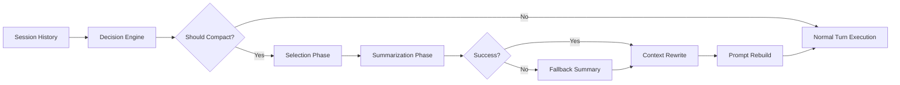

### Core Design Principles

1. **Session-Local Operation**: Compaction only affects the current session's live context. Logs preserve the full conversation history.

2. **Hard Summary Boundary**: Once turns are compacted, they are removed from live context and only exist in summary form.

3. **Adaptive Retention**: The system ensures at least one raw turn remains, adapting retention limits downward on small histories.

4. **Graceful Degradation**: If summarization fails, a deterministic fallback is generated rather than aborting the turn.

5. **Observable Behavior**: All compaction decisions and results are inspectable via CLI commands and logs.

### Rolling Summary Accumulation

Over multiple compactions, summaries accumulate in a layered fashion:

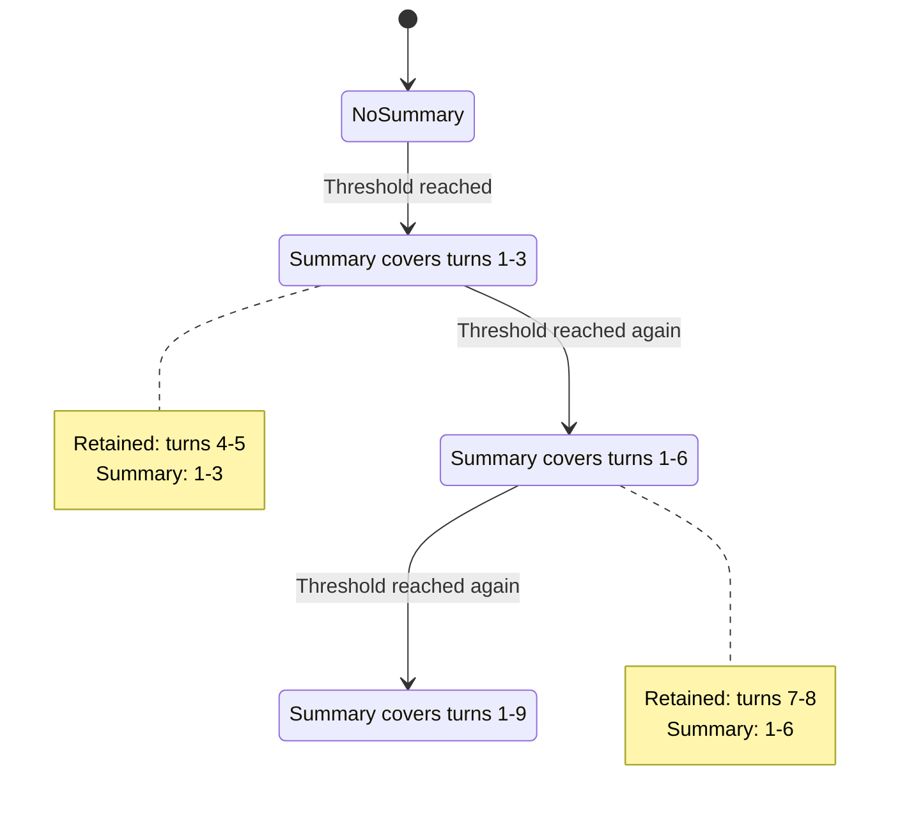

### Prompt Structure After Compaction

The rebuilt prompt has a deliberate structure:

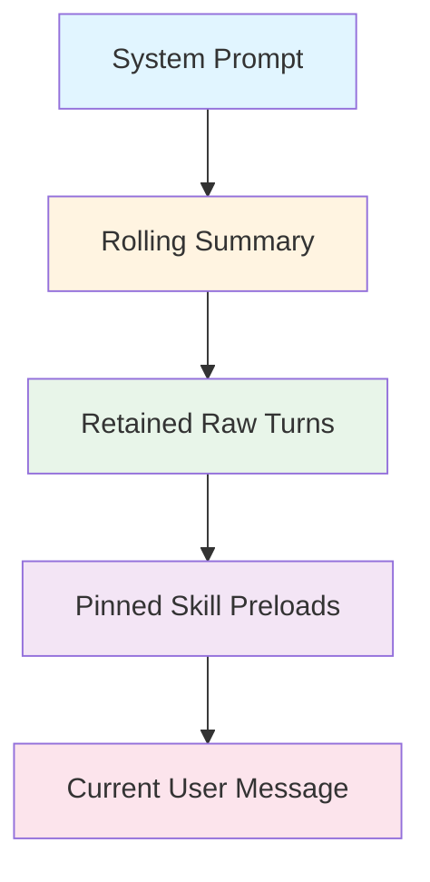

---

## Core Components

### Component Hierarchy

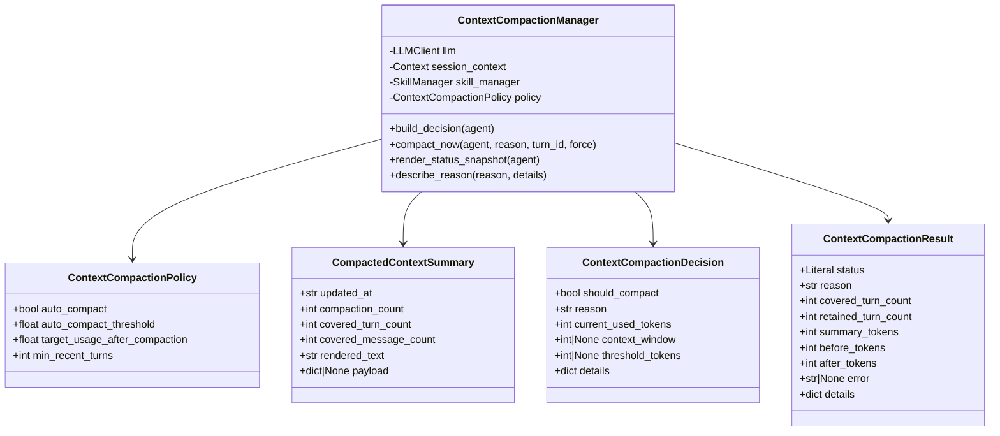

### ContextCompactionPolicy

**Purpose**: Immutable configuration controlling automatic compaction behavior.

**Fields**:
- `auto_compact: bool` - Enable/disable automatic compaction globally
- `auto_compact_threshold: float` - Trigger threshold (0.0-1.0, e.g., 0.85 = 85%)
- `target_usage_after_compaction: float` - Target usage after compaction (0.0-1.0, e.g., 0.60 = 60%)
- `min_recent_turns: int` - Minimum recent turns to retain in raw form

**Validation Rules**:
- Threshold must be between 0 and 1 (exclusive)
- Target must be between 0 and 1 (exclusive)
- Target must be less than threshold (prevents immediate re-compaction)

### ContextCompactionDecision

**Purpose**: Immutable decision result indicating whether compaction should run.

**Fields**:
- `should_compact: bool` - Whether compaction should execute
- `reason: str` - Machine-readable reason code
- `current_used_tokens: int` - Current token usage
- `context_window: int | None` - Configured context window
- `threshold_tokens: int | None` - Threshold in tokens
- `details: dict` - Additional debugging information

**Reason Codes**:
- `config_disabled` - Auto-compaction disabled in config
- `session_disabled` - Auto-compaction disabled for this session
- `unknown_context_window` - Context window not configured
- `insufficient_turns` - Fewer than 2 complete turns
- `no_evictable_turns` - No turns available after retention policy
- `below_threshold` - Usage below trigger threshold
- `threshold_reached` - Usage at or above threshold

### ContextCompactionResult

**Purpose**: Immutable result of a compaction attempt.

**Fields**:
- `status: Literal["compacted", "skipped", "failed"]` - Outcome status
- `reason: str` - Human-readable explanation
- `covered_turn_count: int` - Total turns covered by summary
- `retained_turn_count: int` - Turns retained in raw form
- `summary_tokens: int` - Estimated token count of summary
- `before_tokens: int` - Token count before compaction
- `after_tokens: int` - Token count after compaction
- `error: str | None` - Error message if summarization failed
- `details: dict` - Additional debugging information

### ContextCompactionManager

**Purpose**: Main orchestration class for compaction operations.

**Responsibilities**:
1. Build compaction decisions before each turn
2. Execute compaction when triggered
3. Generate or fallback to summary text
4. Manage context rewrite and prompt rebuild
5. Provide observable state for CLI commands

**Key Methods**:
- `build_decision(agent)` - Evaluate whether to compact
- `compact_now(agent, reason, turn_id, force)` - Execute compaction
- `render_status_snapshot(agent)` - Generate CLI display data
- `describe_reason(reason, details)` - Human-readable explanations

### CompactedContextSummary

**Purpose**: Immutable rolling summary stored in session context.

**Fields**:
- `updated_at: str` - ISO timestamp of last update
- `compaction_count: int` - Number of compaction cycles
- `covered_turn_count: int` - Total turns summarized
- `covered_message_count: int` - Total messages summarized
- `rendered_text: str` - Freeform summary text
- `payload: dict | None` - Reserved for future structured data

---

## Compaction Strategy

### The Selection Algorithm

Compaction follows a four-phase algorithm:

#### Phase 1: Extract Complete Turns

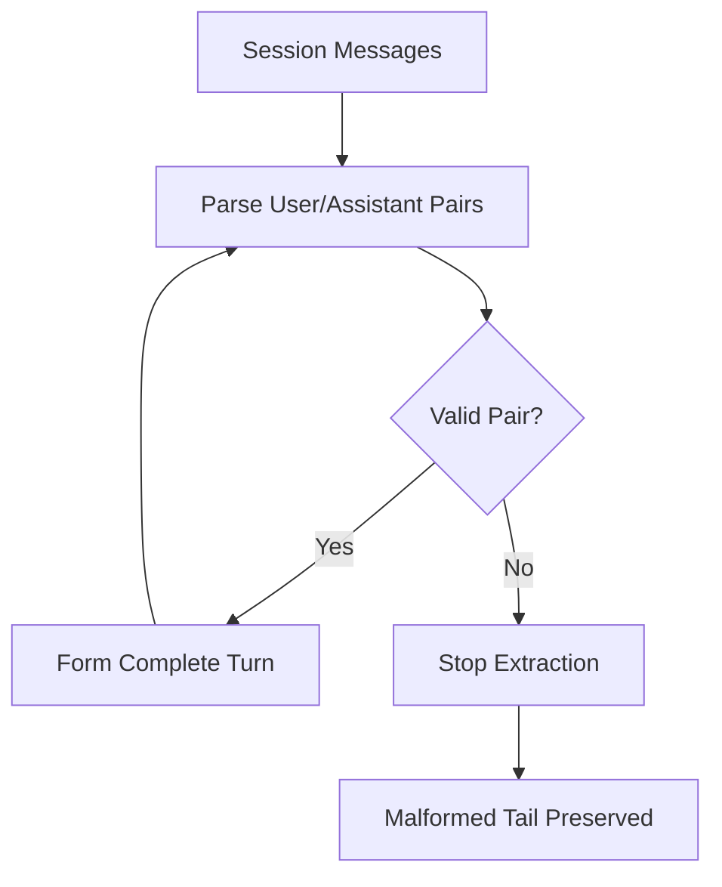

The system extracts the longest valid prefix of alternating user/assistant turns. Any malformed tail (e.g., assistant response without user message) is preserved but not considered for compaction.

**Implementation** (`Context.get_complete_turns()`):
```python
turns = []
index = 0
turn_index = 1

while index + 1 < len(self.messages):
    user_message = self.messages[index]
    assistant_message = self.messages[index + 1]
    if user_message.get("role") != "user" or assistant_message.get("role") != "assistant":
        break

    turns.append(ConversationTurn(
        index=turn_index,
        user_message=user_message,
        assistant_message=assistant_message,
    ))
    turn_index += 1
    index += 2

return turns
```

#### Phase 2: Apply Adaptive Retention

The system ensures at least one raw turn remains by adapting retention downward:

```python
effective_retained_turn_count = min(self.policy.min_recent_turns, len(turns) - 1)
retained_turns = turns[-effective_retained_turn_count:]
evictable_turns = turns[:-effective_retained_turn_count]
```

**Examples**:
- 10 turns, policy retains 6 → Keep 6, evict 4
- 3 turns, policy retains 6 → Keep 2, evict 1 (adapted down)
- 1 turn, policy retains 6 → Skip compaction (insufficient turns)

#### Phase 3: Select Turns for Compaction

**Automatic Mode** (threshold-based):
Select oldest evictable turns until approaching target usage:

```python
removed_tokens = 0
turns_to_compact = []

for turn in evictable_turns:
    turns_to_compact.append(turn)
    removed_tokens += estimate_json_tokens([turn.user_message, turn.assistant_message])
    if snapshot.used_tokens - removed_tokens <= target_tokens:
        break

retained_turns = turns[len(turns_to_compact):]
```

**Manual Mode** (force=True):
Select all evictable turns for maximum compaction:

```python
turns_to_compact = evictable_turns
retained_turns = turns[-effective_retained_turn_count:]
```

#### Phase 4: Tool Output Pruning

Before summarization, replace bulky tool outputs with placeholders:

```python
for message in self.session_context.messages[:cutoff]:
    if message.get("role") == "tool" and message.get("content"):
        message["content"] = "[tool output omitted]"
```

This reduces token load while preserving turn structure.

### Turn Selection Visualization

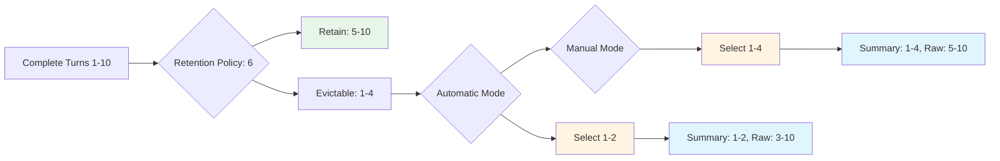

---

## Decision Logic

### Decision Flow

The `build_decision()` method implements a comprehensive decision tree:

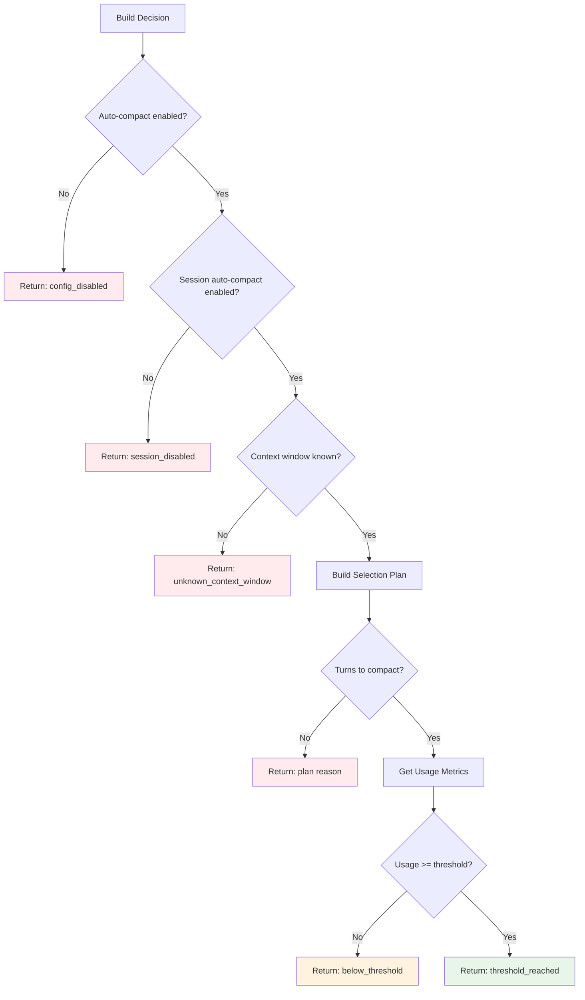

### Usage Metric Selection

The system prefers actual prompt metrics over estimates:

```python
if self.session_context.last_prompt_tokens is not None:
    current_used_tokens = self.session_context.last_prompt_tokens
    context_window = self.session_context.last_context_window
    metrics_source = "last_prompt"
else:
    current_used_tokens = snapshot.used_tokens
    context_window = snapshot.context_window
    metrics_source = "estimate"
```

This provides accuracy when possible while falling back gracefully.

### Complete Decision Logic

```python
def build_decision(self, agent) -> ContextCompactionDecision:
    # Step 1: Gather metrics
    snapshot = build_context_usage_snapshot(agent, self.session_context, self.skill_manager)
    plan = self._build_plan(agent, force=False)

    # Step 2: Select usage source (prefer actual over estimate)
    if self.session_context.last_prompt_tokens is not None:
        current_used_tokens = self.session_context.last_prompt_tokens
        context_window = self.session_context.last_context_window or snapshot.context_window
    else:
        current_used_tokens = snapshot.used_tokens
        context_window = snapshot.context_window

    # Step 3: Calculate threshold
    threshold_tokens = None if context_window is None else int(
        context_window * self.policy.auto_compact_threshold
    )

    # Step 4: Check preconditions
    if not self.policy.auto_compact:
        return ContextCompactionDecision(
            should_compact=False,
            reason="config_disabled",
            current_used_tokens=current_used_tokens,
            context_window=context_window,
            threshold_tokens=threshold_tokens,
        )

    if not self.session_context.is_auto_compaction_enabled():
        return ContextCompactionDecision(
            should_compact=False,
            reason="session_disabled",
            # ... same metrics
        )

    if context_window is None:
        return ContextCompactionDecision(
            should_compact=False,
            reason="unknown_context_window",
            # ... same metrics
        )

    if not plan.turns_to_compact:
        return ContextCompactionDecision(
            should_compact=False,
            reason=plan.reason,  # insufficient_turns or no_evictable_turns
            # ... same metrics
        )

    # Step 5: Check threshold
    if current_used_tokens < threshold_tokens:
        return ContextCompactionDecision(
            should_compact=False,
            reason="below_threshold",
            # ... same metrics
        )

    # Step 6: All checks passed - compact!
    return ContextCompactionDecision(
        should_compact=True,
        reason="threshold_reached",
        # ... same metrics
    )
```

---

## Summary Generation

### Template-Based Summarization

The system uses a structured template to ensure consistent summaries:

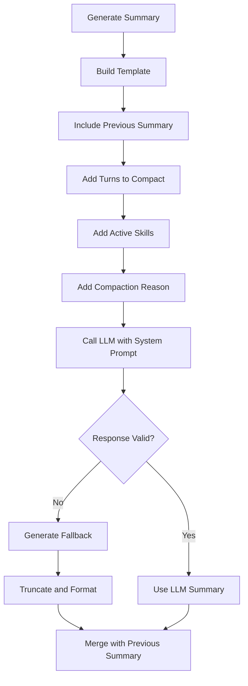

### System Prompt

The summarizer receives explicit instructions:

```
You are summarizing older conversation turns for context compaction.
Return only freeform text using the exact template provided.
Preserve user goals, repository facts, user preferences, completed work,
open loops, and important files. If a section has no content, write '- none'.
Do not include markdown fences or extra commentary.
```

### Template Structure

```markdown
Conversation summary for earlier turns:

## Goal
- ...

## Instructions
- ...

## Discoveries
- ...

## Accomplished
- ...

## Relevant files / directories
- ...

This summary replaces older raw turns. Prefer recent raw turns if they conflict.
```

### Input Data Structure

The summarizer receives JSON input:

```json
{
  "previous_summary": "...existing summary text...",
  "turns_to_compact": [
    {
      "turn_index": 1,
      "user": "original user message content",
      "assistant": "original assistant response content"
    },
    // ... more turns
  ],
  "active_skills": ["skill1", "skill2"],
  "reason": "threshold_reached"
}
```

### Fallback Summary

If LLM summarization fails, a deterministic fallback is generated:

```python
def _build_fallback_summary(self, turns_to_compact: list[Any]) -> tuple[dict | None, str]:
    lines = ["Conversation summary for earlier turns:", ""]

    # Include previous summary if exists
    previous_summary = self.session_context.get_summary()
    if previous_summary and previous_summary.rendered_text:
        lines.append("## Prior summary")
        lines.append(previous_summary.rendered_text.strip())
        lines.append("")

    # Extract goals from user messages
    lines.append("## Goal")
    if turns_to_compact:
        for turn in turns_to_compact:
            lines.append(f"- {self._truncate_text(turn.user_message.get('content', ''))}")
    else:
        lines.append("- none")
    lines.append("")

    # Empty instructions section
    lines.append("## Instructions")
    lines.append("- none")
    lines.append("")

    # Note about fallback
    lines.append("## Discoveries")
    lines.append("- Fallback summary generated because automatic context summarization failed.")
    lines.append("")

    # Extract accomplishments from assistant messages
    lines.append("## Accomplished")
    if turns_to_compact:
        for turn in turns_to_compact:
            lines.append(f"- {self._truncate_text(turn.assistant_message.get('content', ''))}")
    else:
        lines.append("- none")
    lines.append("")

    # Empty files section
    lines.append("## Relevant files / directories")
    lines.append("- none")
    lines.append("")

    lines.append("This summary replaces older raw turns. Prefer recent raw turns if they conflict.")
    return None, "\n".join(lines).strip()
```

### Summary Accumulation

Each compaction merges with the previous summary:

```python
previous_summary = self.session_context.get_summary()
compaction_count = (previous_summary.compaction_count if previous_summary else 0) + 1
covered_turn_count = (previous_summary.covered_turn_count if previous_summary else 0) + len(plan.turns_to_compact)
covered_message_count = (previous_summary.covered_message_count if previous_summary else 0) + (len(plan.turns_to_compact) * 2)
```

This ensures summaries are cumulative rather than fragmented.

---

## Configuration

### Configuration Hierarchy

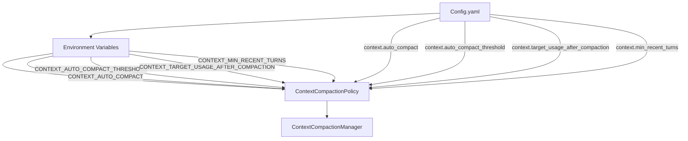

### Configuration Parameters

#### `auto_compact: bool`

**Default**: `true`

**Purpose**: Enable/disable automatic compaction globally

**Environment Variable**: `CONTEXT_AUTO_COMPACT`

**When to Change**:
- Set to `false` for debugging or testing
- Keep `true` for production usage

#### `auto_compact_threshold: float`

**Default**: `0.85` (85%)

**Purpose**: Trigger automatic compaction when usage reaches this percentage

**Environment Variable**: `CONTEXT_AUTO_COMPACT_THRESHOLD`

**Validation**: Must be between 0 and 1 (exclusive)

**Guidelines**:
- **Higher (0.85-0.90)**: Maximizes context preservation, less frequent compaction
- **Lower (0.70-0.80)**: More aggressive compaction, safer margin from context limit
- **Too low (< 0.70)**: May compact too frequently, losing context unnecessarily

#### `target_usage_after_compaction: float`

**Default**: `0.60` (60%)

**Purpose**: Target usage percentage after compaction completes

**Environment Variable**: `CONTEXT_TARGET_USAGE_AFTER_COMPACTION`

**Validation**: Must be between 0 and 1 (exclusive), and less than `auto_compact_threshold`

**Guidelines**:
- **Higher (0.70-0.75)**: Minimal compaction, preserves more context
- **Lower (0.50-0.60)**: More aggressive compaction, creates more headroom
- **Relationship to threshold**: Should be 20-30% below threshold to prevent immediate re-compaction

#### `min_recent_turns: int`

**Default**: `6`

**Purpose**: Minimum number of recent turns to retain in raw form

**Environment Variable**: `CONTEXT_MIN_RECENT_TURNS`

**Validation**: Must be >= 1

**Guidelines**:
- **Higher (8-12)**: Better short-term continuity, less compaction effectiveness
- **Lower (2-4)**: More aggressive compaction, may lose immediate context
- **Very small sessions**: Automatically adapts downward to ensure at least 1 raw turn

### Example Configurations

#### Conservative Configuration (Maximum Context Preservation)

```yaml
context:
  auto_compact: true
  auto_compact_threshold: 0.90      # Compact at 90%
  target_usage_after_compaction: 0.70  # Target 70%
  min_recent_turns: 8               # Keep 8 recent turns
```

**Use Case**: Sessions where preserving context is critical, and you have a large context window.

#### Balanced Configuration (Recommended)

```yaml
context:
  auto_compact: true
  auto_compact_threshold: 0.85      # Compact at 85%
  target_usage_after_compaction: 0.60  # Target 60%
  min_recent_turns: 6               # Keep 6 recent turns
```

**Use Case**: General-purpose coding sessions with standard context windows.

#### Aggressive Configuration (Maximum Token Savings)

```yaml
context:
  auto_compact: true
  auto_compact_threshold: 0.75      # Compact at 75%
  target_usage_after_compaction: 0.50  # Target 50%
  min_recent_turns: 3               # Keep 3 recent turns
```

**Use Case**: Very long sessions with small context windows, where token efficiency is critical.

### Configuration Validation

The system validates configuration relationships:

```python
if self.context.target_usage_after_compaction >= self.context.auto_compact_threshold:
    raise ValueError(
        "context.target_usage_after_compaction must be less than "
        "context.auto_compact_threshold"
    )
```

This prevents compaction loops where the system compacts, then immediately needs to compact again.

---

## Integration Points

### Agent Integration

The compaction manager is integrated into the agent lifecycle:

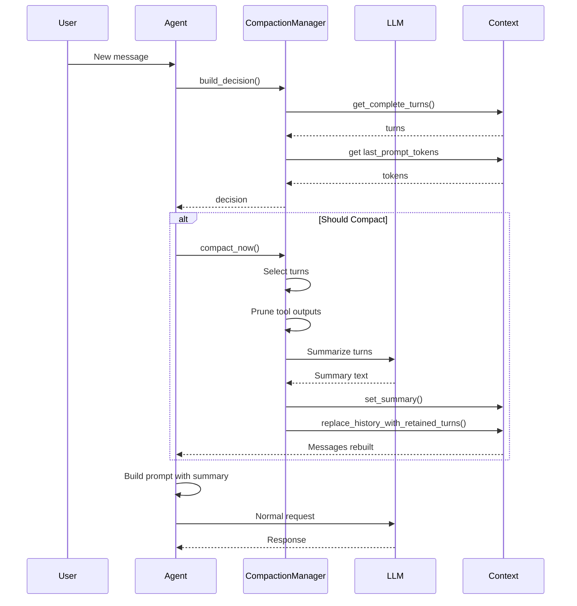

### Context Integration Points

The `Context` class provides several methods for compaction:

#### Summary Management

```python
def get_summary(self) -> Optional[CompactedContextSummary]:
    """Return the current rolling summary, if any."""
    return self.summary

def set_summary(self, summary: Optional[CompactedContextSummary]) -> None:
    """Replace the current rolling summary."""
    self.summary = summary

def get_summary_message(self) -> Optional[Dict[str, Any]]:
    """Return the synthetic assistant summary message for the next call."""
    if self.summary is None or not self.summary.rendered_text:
        return None
    return {"role": "assistant", "content": self.summary.rendered_text}
```

#### History Rewrite

```python
def replace_history_with_retained_turns(self, retained_turns: List[ConversationTurn]) -> None:
    """Replace the compactable message prefix while preserving malformed tail messages."""
    complete_turns = self.get_complete_turns()
    prefix_message_count = len(complete_turns) * 2
    malformed_tail = self.messages[prefix_message_count:]

    new_messages: List[Dict[str, Any]] = []
    for turn in retained_turns:
        new_messages.append(dict(turn.user_message))
        new_messages.append(dict(turn.assistant_message))
    new_messages.extend(dict(message) for message in malformed_tail)
    self.messages = new_messages
```

This preserves malformed messages while replacing the valid prefix.

#### Session Control

```python
def set_auto_compaction(self, enabled: bool) -> None:
    """Enable or disable auto-compaction for the current session."""
    self.auto_compaction_enabled = enabled

def is_auto_compaction_enabled(self) -> bool:
    """Return whether auto-compaction is enabled for this session."""
    return self.auto_compaction_enabled
```

### Context Usage Integration

The `build_context_usage_snapshot()` function provides token estimates:

```python
snapshot = build_context_usage_snapshot(agent, self.session_context, self.skill_manager)
```

**Snapshot Contents**:
- Model and context window
- Token usage by category (system prompt, tools, messages, etc.)
- Per-message token counts
- Free space and overflow calculations
- Informational notes

### Agent Turn Flow

Compaction is triggered in `_initialize_turn()`:

```python
def _initialize_turn(self, user_message: str, on_event: Optional[TurnActivityCallback] = None):
    # ... setup code ...

    # Cache tool schemas for hot-path optimization
    if self._cached_tool_schemas is None:
        self._cached_tool_schemas = self.tools.get_tool_schemas()

    # Auto-compact before the first LLM call
    self._maybe_auto_compact(turn_id, on_event)

    # ... continue with normal turn flow
```

This ensures compaction happens before any LLM requests.

---

## Observable State

### CLI Commands

The system provides several commands for observing compaction state:

#### `/compact` - Show Status

Displays current compaction status:

```
Auto-compaction: enabled
Auto-compact threshold: 85% (85000 tokens)
Target after compaction: 60% (60000 tokens)
Min recent turns: 6

Current usage: 92% (92000 / 100000 tokens)
Decision: Compact (threshold reached)
Reason: Estimated usage reached the auto-compaction threshold (92000 >= 85000 tokens)

Complete turns: 10
Evictable turns: 4
Effective recent turns retained: 6
Summary present: yes
Summary compaction count: 2
Summary covered turns: 6
Raw retained turns: 6
```

#### `/compact show` - Show Summary

Displays the current rolling summary:

```
Conversation summary for earlier turns:

## Goal
- Implement user authentication system
- Add OAuth2 integration
- Create user profile management

## Instructions
- Use JWT for session tokens
- Implement password hashing with bcrypt
- Follow RESTful conventions

## Discoveries
- Project uses FastAPI framework
- Database models are in src/models/
- Configuration is in config.yaml

## Accomplished
- Created User model with email and password fields
- Implemented /auth/register endpoint
- Added password hashing utility
- Set up JWT token generation

## Relevant files / directories
- src/models/user.py
- src/api/auth.py
- src/utils/hash.py
- config.yaml

This summary replaces older raw turns. Prefer recent raw turns if they conflict.
```

#### `/compact now` - Force Compaction

Immediately compacts with step-by-step output:

```
Forcing immediate compaction...

Current state:
- Complete turns: 10
- Evictable turns: 4
- Current tokens: 92000

Selection:
- Turns to compact: 4 (turns 1-4)
- Turns to retain: 6 (turns 5-10)

Generating summary...
✓ Summary generated (2450 tokens)

Rewriting context...
✓ History updated

Result:
- Status: compacted
- Covered turns: 10
- Retained turns: 6
- Before: 92000 tokens
- After: 58000 tokens
- Saved: 34000 tokens (37% reduction)
```

#### `/compact auto on|off` - Toggle Session Auto-Compaction

Enable or disable automatic compaction for the current session:

```
Auto-compaction enabled for this session.
Use '/compact auto off' to disable.
```

### Logging

All compaction operations are logged:

#### `llm.log`

Records compaction LLM requests with `request_kind=context_compaction`:

```json
{
  "timestamp": "2025-03-03T10:23:45.123Z",
  "turn_id": 5,
  "request_kind": "context_compaction",
  "messages": [
    {
      "role": "system",
      "content": "You are summarizing older conversation turns..."
    },
    {
      "role": "user",
      "content": "Summarize these older turns into the template below..."
    }
  ],
  "response": {
    "role": "assistant",
    "content": "Conversation summary for earlier turns:\n\n## Goal\n..."
  }
}
```

#### `events.jsonl`

Records compaction lifecycle events:

```json
{"kind": "context_compaction_started", "timestamp": "...", "turn_id": 5, "details": {...}}
{"kind": "context_compaction_completed", "timestamp": "...", "turn_id": 5, "details": {...}}
{"kind": "context_compaction_failed", "timestamp": "...", "turn_id": 5, "error": "..."}
```

### Status Snapshot Format

The `render_status_snapshot()` method returns a structured dictionary:

```python
{
    "auto_compaction_enabled": True,
    "configured_auto_compact": True,
    "auto_compact_threshold": 0.85,
    "target_usage_after_compaction": 0.60,
    "min_recent_turns": 6,
    "effective_retained_turns": 6,
    "current_used_tokens": 92000,
    "current_used_percentage": 92.0,
    "summary_present": True,
    "summary_compaction_count": 2,
    "summary_covered_turn_count": 6,
    "summary_covered_message_count": 12,
    "raw_retained_turn_count": 6,
    "context_window": 100000,
    "decision_should_compact": True,
    "decision_reason": "threshold_reached",
    "decision_reason_text": "Estimated usage reached the auto-compaction threshold (92000 >= 85000 tokens).",
    "decision_details": {...},
    "threshold_tokens": 85000,
}
```

---

## Error Handling

### Failure Modes

The compaction system handles several failure scenarios gracefully:

#### 1. LLM Summarization Failure

**Scenario**: The LLM request fails due to network error, API rate limit, or other issues.

**Handling**: Generate a deterministic fallback summary:

```python
try:
    self._prune_tool_outputs(plan)
    payload, rendered_text = self._generate_summary(plan.turns_to_compact, reason, turn_id)
    summary_error = None
except Exception as exc:
    payload, rendered_text = self._build_fallback_summary(plan.turns_to_compact)
    summary_error = str(exc)
```

**Result**:
- Compaction continues with fallback summary
- Turn proceeds normally
- Error is recorded in `ContextCompactionResult.error`

#### 2. Empty LLM Response

**Scenario**: LLM returns empty or whitespace-only content.

**Handling**:

```python
response, _metrics = self.llm.chat(messages, tools=None, log_context=...)
rendered = (response.get("content") or "").strip()
if not rendered:
    raise ValueError("empty summarizer output")
```

**Result**: Falls back to deterministic summary

#### 3. Insufficient Turns

**Scenario**: Fewer than 2 complete turns in session history.

**Handling**: Skip compaction with reason `insufficient_turns`

**Result**:
- No compaction performed
- Session continues normally
- Next re-evaluation will occur on next turn

#### 4. No Evictable Turns

**Scenario**: All turns are needed to satisfy retention policy.

**Handling**: Skip compaction with reason `no_evictable_turns`

**Result**:
- No compaction performed
- Session continues normally
- May compact on future turns as more history accumulates

#### 5. Unknown Context Window

**Scenario**: Context window not configured, threshold-based decisions impossible.

**Handling**:
- Automatic compaction skipped with reason `unknown_context_window`
- Manual compaction still works (uses all evictable turns)

**Result**:
- Auto-compaction disabled until context window configured
- Manual compaction remains available

### Error Recovery

All error scenarios follow this pattern:

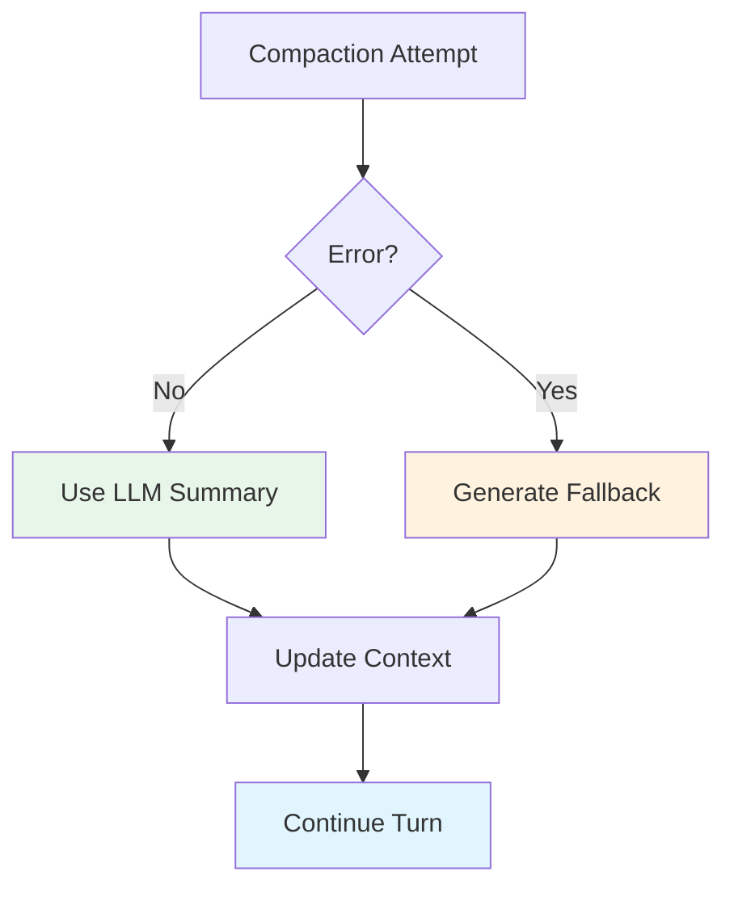

**Key Principle**: Compaction failure is a quality issue, not a control-flow issue. The turn always proceeds.

---

## Performance Characteristics

### Token Savings

The system achieves significant token reduction:

**Example Calculation**:
- Before compaction: 92,000 tokens (92% of 100K window)
- After compaction: 58,000 tokens (58% of 100K window)
- **Savings: 34,000 tokens (37% reduction)**

**Factors Affecting Savings**:
1. **Turn Size**: Larger turns yield greater savings
2. **Compaction Ratio**: More turns compacted = more savings
3. **Summary Efficiency**: LLM's ability to condense information
4. **Retention Policy**: Higher retention = fewer savings

### Compaction Cost

Running the summarizer has its own token cost:

**Input Tokens**:
- System prompt: ~100 tokens
- Template structure: ~150 tokens
- Previous summary: ~2,000-5,000 tokens (accumulates)
- Turns to compact: ~500-2,000 tokens per turn
- Active skills: ~50-200 tokens
- **Total**: ~3,000-10,000 tokens

**Output Tokens**:
- Generated summary: ~1,000-3,000 tokens
- **Total**: ~1,000-3,000 tokens

**Net Benefit**:
- Cost: ~4,000-13,000 tokens per compaction
- Savings: ~20,000-50,000 tokens per compaction
- **Net gain**: ~15,000-40,000 tokens

### Performance Over Multiple Compactions

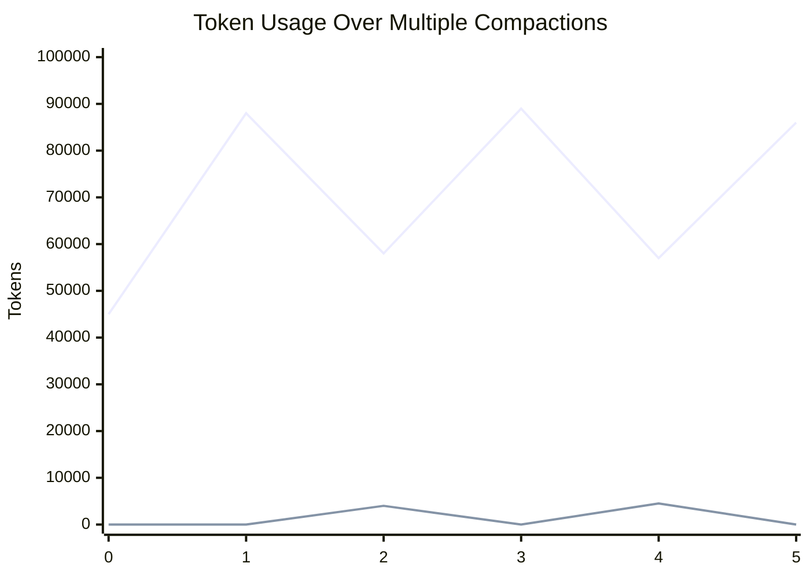

**Legend**:
- Blue line: Total usage before/after each compaction
- Orange line: Compaction cost (summarizer tokens)

**Observations**:
1. Each compaction reduces usage significantly
2. Compaction cost is small relative to savings
3. Usage gradually increases between compactions
4. Net token budget is extended by 2-3x

### Latency Impact

**Compaction Duration**:
- Network latency: ~500-2000ms
- LLM processing: ~2000-5000ms (varies by model)
- **Total**: ~2.5-7 seconds per compaction

**Frequency**:
- Triggered only when threshold is reached
- Typically once every 5-15 turns (depending on turn size)
- **Amortized overhead**: ~200-500ms per turn

### Trade-offs

| Configuration | Token Savings | Context Quality | Compaction Frequency |
|--------------|---------------|-----------------|---------------------|
| Conservative (threshold=0.90, target=0.70) | Lower | Higher | Less frequent |
| Balanced (threshold=0.85, target=0.60) | Medium | Medium | Medium frequency |
| Aggressive (threshold=0.75, target=0.50) | Higher | Lower | More frequent |

---

## Best Practices

### Setting Thresholds

**Rule of Thumb**: Keep threshold 20-30% above target

```yaml
# Good: 25% gap
auto_compact_threshold: 0.85
target_usage_after_compaction: 0.60

# Bad: Only 5% gap (may re-compact immediately)
auto_compact_threshold: 0.65
target_usage_after_compaction: 0.60

# Bad: Target >= threshold (configuration error)
auto_compact_threshold: 0.60
target_usage_after_compaction: 0.65  # ERROR!
```

**Why**: Ensures meaningful compaction while preventing immediate re-compaction.

### Retention Policy Guidelines

**For Large Context Windows (100K+ tokens)**:
```yaml
min_recent_turns: 8-12  # Preserve more recent context
```

**For Small Context Windows (< 32K tokens)**:
```yaml
min_recent_turns: 3-6   # More aggressive compaction
```

**For Rapid-Fire Tool Usage**:
```yaml
min_recent_turns: 4-6   # Balance between context and efficiency
```

### When to Use Manual Compaction

Use `/compact now` when:
- You know the session will continue for a long time
- You want to reduce token costs before a large operation
- You're approaching the context window and want to ensure safety

**Don't** over-manually compact:
- The automatic system is well-tuned
- Manual compaction may reduce context quality unnecessarily
- Let the threshold guide automatic compaction

### Session Management

**Disable auto-compaction when**:
- Debugging compaction behavior
- Testing with small contexts
- Analyzing conversation patterns

```python
# In code
context.set_auto_compaction(False)

# Via CLI
/compact auto off
```

**Re-enable after debugging**:
```python
context.set_auto_compaction(True)
/compact auto on
```

### Monitoring Compaction Health

**Check regularly with**:
```bash
/compact                    # Show status and decision
/context                     # Show detailed usage breakdown
/compact show                # Review summary quality
```

**Watch for**:
- Frequent compaction (every 1-2 turns) → May need higher threshold
- Very long summaries (> 5000 tokens) → May need more aggressive target
- "Fallback summary" in logs → Check LLM connectivity

### Testing Compaction

When testing compaction-related features:

```python
def test_compaction_behavior():
    # Use a small context window for faster testing
    cfg.llm.context_window = 400

    # Use realistic retention
    cfg.context.min_recent_turns = 2

    # Set thresholds to trigger quickly
    cfg.context.auto_compact_threshold = 0.85
    cfg.context.target_usage_after_compaction = 0.60

    # Add enough turns to exceed threshold
    add_turns(context, 5, size=120)

    # Verify compaction occurred
    decision = manager.build_decision(agent)
    assert decision.should_compact
```

---

## Examples

### Example 1: First Compaction

**Initial State**:
- Complete turns: 8
- Usage: 87,000 tokens (87% of 100K)
- Threshold: 85% (85,000 tokens)
- Retention policy: 6 recent turns

**Decision**: `threshold_reached` (87,000 >= 85,000)

**Selection**:
- Retain: turns 3-8 (6 turns)
- Evictable: turns 1-2 (2 turns)
- Selected: turns 1-2 (all evictable, sufficient to reach target)

**Result**:
```
Status: compacted
Covered turns: 2
Retained turns: 6
Before: 87,000 tokens
After: 58,000 tokens
Saved: 29,000 tokens (33% reduction)
Summary: 1,800 tokens
```

**New Prompt Structure**:
```
[System Prompt]
[Summary (1,800 tokens)]
[Raw turns 3-8 (56,200 tokens)]
[Current user message]
Total: ~58,000 tokens
```

### Example 2: Repeated Compaction

**After Several More Turns**:
- Complete turns: 12 (including retained 6 from before)
- Usage: 91,000 tokens (91% of 100K)
- Previous summary: Covers turns 1-2

**Decision**: `threshold_reached` again

**Selection**:
- Retain: turns 7-12 (6 turns)
- Evictable: turns 3-6 (4 turns)
- Selected: turns 3-4 (sufficient to reach target)

**Result**:
```
Status: compacted
Covered turns: 4 (2 new + 2 previous)
Retained turns: 6
Before: 91,000 tokens
After: 59,000 tokens
Saved: 32,000 tokens (35% reduction)
Summary: 2,400 tokens (merged with previous)
```

**Accumulated Summary**:
```
## Goal
- (from turns 1-2) Implement authentication
- (from turns 3-4) Add profile management

## Accomplished
- (from turns 1-2) Created User model, auth endpoints
- (from turns 3-4) Implemented profile CRUD, avatar upload
```

### Example 3: Adaptive Retention on Small Session

**Initial State**:
- Complete turns: 3
- Usage: 4,500 tokens (of 5K context window)
- Retention policy: 6 recent turns

**Decision**: `threshold_reached`

**Selection (Adapted)**:
- Effective retention: min(6, 3-1) = 2 turns
- Retain: turns 2-3
- Evictable: turn 1
- Selected: turn 1

**Result**:
```
Status: compacted
Covered turns: 1
Retained turns: 2
Before: 4,500 tokens
After: 2,800 tokens
Saved: 1,700 tokens (38% reduction)
```

**Key Point**: System adapted retention from 6 to 2 to ensure at least 1 raw turn remained.

### Example 4: Manual Compaction

**Initial State**:
- Complete turns: 10
- Usage: 65,000 tokens (65% of 100K)
- Threshold: 85% (not reached)

**User Command**: `/compact now`

**Selection (Force Mode)**:
- Retain: turns 5-10 (6 turns per policy)
- Evictable: turns 1-4
- Selected: turns 1-4 (ALL evictable, ignoring target)

**Result**:
```
Status: compacted (forced)
Covered turns: 4
Retained turns: 6
Before: 65,000 tokens
After: 42,000 tokens
Saved: 23,000 tokens (35% reduction)
Reason: manual_command
```

**Use Case**: User knows session will be long, wants to create headroom proactively.

### Example 5: Insufficient Turns

**Initial State**:
- Complete turns: 1
- Usage: 8,000 tokens (of 10K context window)

**User Command**: `/compact now`

**Decision**: `insufficient_turns`

**Result**:
```
Status: skipped
Reason: Compaction requires at least 2 complete turns so Nano-Coder can keep
        at least 1 raw turn in session history.
Retained turns: 1
```

**Rationale**: Compacting 1 turn would leave 0 raw turns, breaking the invariant.

---

## Conclusion

The context compaction system is a sophisticated solution to the fundamental problem of finite LLM context windows. By combining:

- **Intelligent decision-making** based on multiple signals
- **Adaptive retention** that preserves recent context
- **Rolling summaries** that accumulate over time
- **Graceful degradation** when summarization fails
- **Full observability** via CLI and logs

Nano-Coder enables long-running coding sessions that maintain context quality while operating within token limits. The system is designed to be:

1. **Safe**: Never leaves the session without raw context
2. **Efficient**: Achieves 30-40% token reduction per compaction
3. **Observable**: All decisions and results are inspectable
4. **Configurable**: Tunable for different use cases
5. **Resilient**: Continues operating even when components fail

For developers working with or extending the compaction system, understanding these components, their interactions, and their trade-offs is essential for maintaining and improving this critical infrastructure.

---

## References

- **Implementation**: `/Volumes/CaseSensitive/nano-coder/src/context_compaction.py`
- **Context Management**: `/Volumes/CaseSensitive/nano-coder/src/context.py`
- **Context Usage**: `/Volumes/CaseSensitive/nano-coder/src/context_usage.py`
- **Agent Integration**: `/Volumes/CaseSensitive/nano-coder/src/agent.py`
- **Tests**: `/Volumes/CaseSensitive/nano-coder/tests/test_context_compaction.py`
- **User Documentation**: `/Volumes/CaseSensitive/nano-coder/doc/context-compaction.md`
- **Configuration**: `/Volumes/CaseSensitive/nano-coder/src/config.py` (ContextConfig)
