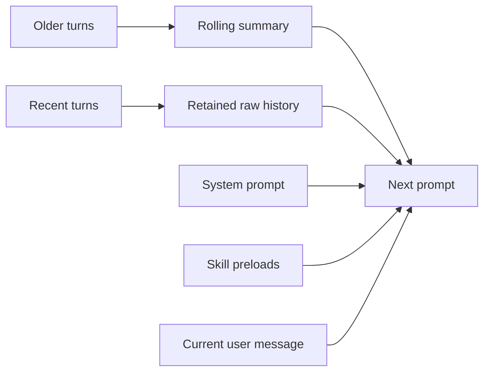
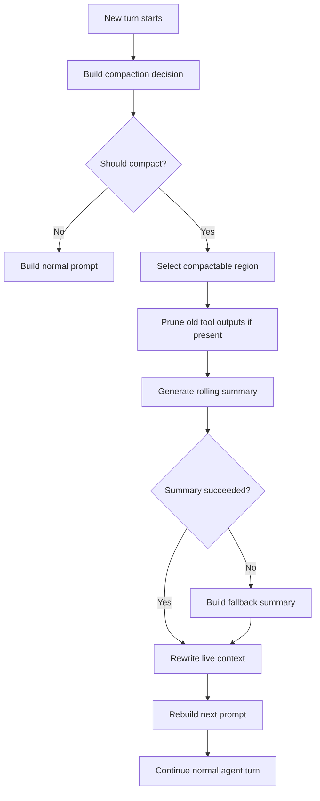
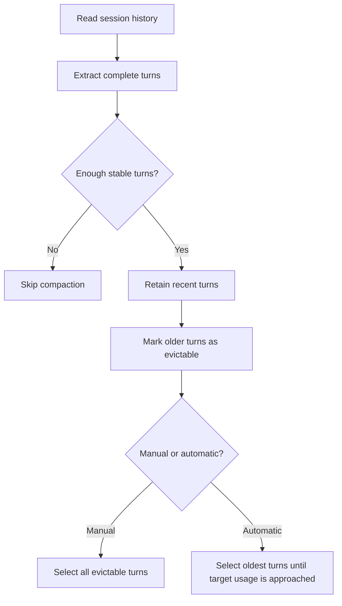
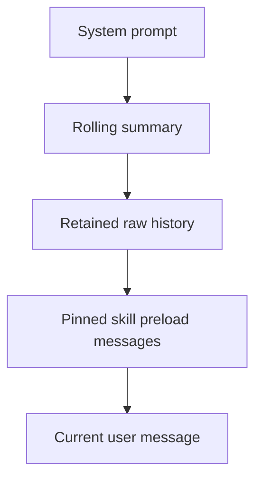

# Context Compaction

## Overview

Nano-Coder uses session-local context compaction to keep long conversations inside the model context window without resorting to blind truncation. The design is intentionally simple:

- older conversation state is compressed into one rolling summary
- recent conversation state stays raw
- the system prompt stays stable
- the logs remain the full record of what actually happened

Compaction is not persistent memory, retrieval, or archival storage. It is a controlled rewrite of the **live prompt state** for the current session.

## One-Screen Mental Model

What gets compacted:

- the oldest well-formed user/assistant turns

What stays raw:

- the most recent retained turns
- any malformed tail outside the compactable turn structure

What the next prompt looks like after compaction:

- system prompt
- rolling summary
- retained raw history
- pinned skill preload messages
- current user message

The key property is the **hard summary boundary**: once a region has been compacted, its raw turns are removed from live context and only the summary remains.

## Design Goals

- Keep long sessions usable within the configured context window.
- Preserve recent-turn fidelity better than hard truncation.
- Keep the system prompt stable and cache-friendly.
- Make compaction visible, inspectable, and debuggable.
- Keep the mechanism session-local and operationally simple.

## Non-Goals

- Cross-session persistent memory.
- Semantic retrieval over prior sessions.
- Tokenizer-exact accounting.
- Reconstructing compacted raw turns back into live context.

## Design Invariants

- The system prompt is not rewritten by compaction.
- Compaction never leaves the session with zero raw turns.
- The summary is the only prompt-time representation of compacted history.
- Malformed tails are preserved rather than normalized or discarded.
- Logs remain the forensic source of truth even after live history is compacted.

## Design Overview

Compaction is a `select -> summarize -> rewrite -> rebuild` pipeline.

- Before a turn begins, Nano-Coder decides whether compaction should run using policy, context-window awareness, the best available usage signal, and whether enough stable history exists to compact safely.
- If compaction runs, Nano-Coder selects the oldest well-formed conversation region, retains a bounded set of recent turns, and leaves any malformed tail unchanged.
- The selected region can first be reduced by pruning old tool outputs or similar bulky low-value payloads.
- The selected region is then compressed by the LLM into one freeform rolling summary, merged with any existing summary.
- If LLM summarization fails, Nano-Coder generates a deterministic fallback summary instead of aborting the turn.
- The live context is then rewritten so the summary represents older history and only the retained recent turns remain raw.
- Future prompts are rebuilt from the stable system prompt, the rolling summary, the retained raw history, skill preloads, and the current user message.
- This enforces the hard summary boundary: older context survives only as summary text, not as duplicated raw turns.

## Decision Inputs

Automatic compaction is driven by a small set of inputs:

| Input | Purpose | If missing or disabled |
| --- | --- | --- |
| Global auto-compaction setting | Enables or disables automatic compaction at the config level | Auto-compaction does not run |
| Session-local auto-compaction toggle | Allows the current session to opt out | Auto-compaction does not run |
| Context window | Defines threshold and target usage | Automatic compaction skips |
| Usage signal | Measures how full the prompt is | Falls back from real prompt metrics to estimated next-call usage |
| Complete-turn availability | Ensures compaction only operates on stable history | Compaction skips if too little stable history exists |
| Retention policy | Determines how much recent history stays raw | Retention adapts downward on small histories |

The preferred usage signal is the prompt token count from the most recent real model call. If that is unavailable, Nano-Coder falls back to the estimated next-call baseline.

## Compaction Algorithm

The algorithm has four conceptual phases.

### 1. Select

Nano-Coder identifies the compactable region by extracting the oldest well-formed user/assistant turn sequence from the current session history. The newest turns are retained raw according to the retention policy, while the older prefix becomes the candidate region for compaction. In automatic mode, only enough of that older region is selected to move prompt usage toward the target. In manual mode, the full evictable region is selected.

### 2. Summarize

Before summarization, the selected region can be reduced further by pruning bulky tool outputs. The remaining selected turns are then compressed by the LLM into one freeform summary using a dedicated compaction request. That summary is merged with any existing summary so the compacted layer remains cumulative rather than fragmented.

### 3. Rewrite

Once a summary exists, live context is rewritten. The new summary becomes the representation of the older conversation, and the retained recent turns remain as raw history. This is where the hard summary boundary is enforced.

### 4. Rebuild

After compaction, the next prompt is assembled from the stable system prompt, the rolling summary, the retained raw history, skill preload messages, and the current user message. Older raw turns are not reattached.

## Execution Flow

This is the end-to-end automatic compaction flow at turn start.

This is the internal selection logic.

## Prompt Assembly After Compaction

The rebuilt prompt has a deliberate order.

- `System prompt`
  Stable policy and tool catalog.
- `Rolling summary`
  The compacted representation of older conversation state.
- `Retained raw history`
  The recent turns kept verbatim for short-term fidelity.
- `Pinned skill preload messages`
  Session-level skill context that should apply to the turn.
- `Current user message`
  The new request.

## Failure Semantics

Compaction is allowed to degrade in quality, but it is not allowed to dead-end the turn.

- If LLM summarization succeeds, the generated summary is used.
- If summarization fails, Nano-Coder builds a deterministic fallback summary from the same selected turns.
- The turn still proceeds after fallback.
- Once fallback is accepted, the old raw region is still removed from live context.
- Quality may be lower, but control flow remains intact.

This is an important operational choice: compaction failure is treated as a summarization-quality problem, not a turn-fatal error.

## Worked Examples

### Example 1: Small Session, Automatic Compaction

Session shape:

- 3 complete turns
- retention policy prefers 6 recent turns
- usage is already over threshold

Outcome:

- Nano-Coder adapts retention downward
- 2 recent turns stay raw
- the oldest 1 turn is summarized
- the next prompt contains summary + 2 raw turns

### Example 2: Larger Session, Automatic Compaction

Session shape:

- 10 complete turns
- retention policy keeps 6 recent turns raw
- usage is over threshold

Outcome:

- the newest 6 turns stay raw
- the oldest region is eligible for compaction
- automatic mode summarizes only as much of that older region as needed to move usage toward target

### Example 3: Manual Compaction on a Tiny Session

Session shape:

- 1 complete turn
- user runs `/compact now`

Outcome:

- compaction is skipped
- no summary is created
- the raw turn stays intact

Reason:

- the system will not compact if doing so would leave zero raw turns

## OpenCode Alignment

Nano-Coder intentionally aligns with the same high-level strategy used by OpenCode in several important ways:

- use a freeform summary rather than a structured JSON memory object
- keep a hard summary boundary
- reconstruct future prompts from summary plus recent raw history
- treat compaction as a separate summarization request, not part of the normal agent reply

Nano-Coder currently differs in a few practical ways:

- tool-output pruning is present as a stage but is effectively a no-op today because tool messages are not persisted in session history
- the trigger prefers real prompt metrics when available but falls back to heuristic estimation
- the system remains explicitly session-local and does not try to become a general memory layer

## Current Implementation Notes

The current implementation is split across these modules:

- [context.py](/Volumes/CaseSensitive/nano-coder/src/context.py)
  Stores live session history, the rolling summary, and last-prompt metrics.
- [context_compaction.py](/Volumes/CaseSensitive/nano-coder/src/context_compaction.py)
  Implements decision logic, selection, summary generation, fallback, and context rewrite.
- [agent.py](/Volumes/CaseSensitive/nano-coder/src/agent.py)
  Triggers auto-compaction before the first model call of a turn and assembles the rebuilt prompt.
- [context_usage.py](/Volumes/CaseSensitive/nano-coder/src/context_usage.py)
  Provides heuristic next-call usage estimates for fallback decision-making.
- [builtin.py](/Volumes/CaseSensitive/nano-coder/src/commands/builtin.py)
  Exposes `/compact` and `/context`.

Current implementation facts worth knowing:

- Summary text is stored as freeform text.
- Summary injection happens as a synthetic assistant message.
- The current pruning stage is architecturally present but operationally inactive unless tool outputs start entering session history.
- Manual compaction forces selection of the full evictable region.
- Automatic compaction is bounded by threshold and target usage.

## Observability

Compaction is intentionally visible in both CLI and logs.

CLI surfaces:

- `/compact`
  Status, decision, and debug details.
- `/compact show`
  The current rolling summary.
- `/compact now`
  Forced compaction with step-by-step output.
- `/context`
  The compacted summary as a distinct next-call context category.

Logs:

- `llm.log`
  Compaction requests and responses with `request_kind=context_compaction`.
- `events.jsonl`
  Compaction lifecycle events.

## Common Skip Reasons

- `config_disabled`
  Automatic compaction is disabled globally.
- `session_disabled`
  Automatic compaction is disabled for the current session.
- `unknown_context_window`
  Threshold-based auto-compaction cannot decide safely.
- `insufficient_turns`
  There is not enough stable history to compact safely.
- `no_evictable_turns`
  All stable history is currently being retained.
- `below_threshold`
  Current usage has not crossed the trigger threshold.

## Practical Consequences

What this design gives you:

- stable system prompt
- bounded growth of live prompt state
- recent raw continuity
- explicit and inspectable compaction behavior

What it does not give you:

- exact recovery of old raw turns
- exact tokenizer behavior
- perfect semantic preservation across arbitrarily long sessions

That is an acceptable tradeoff for a terminal coding agent: logs preserve full history, while live prompt state preserves what is most useful for the next call.
