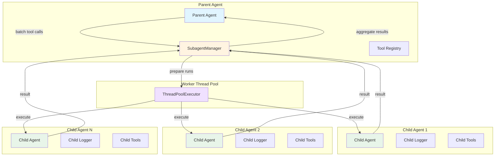
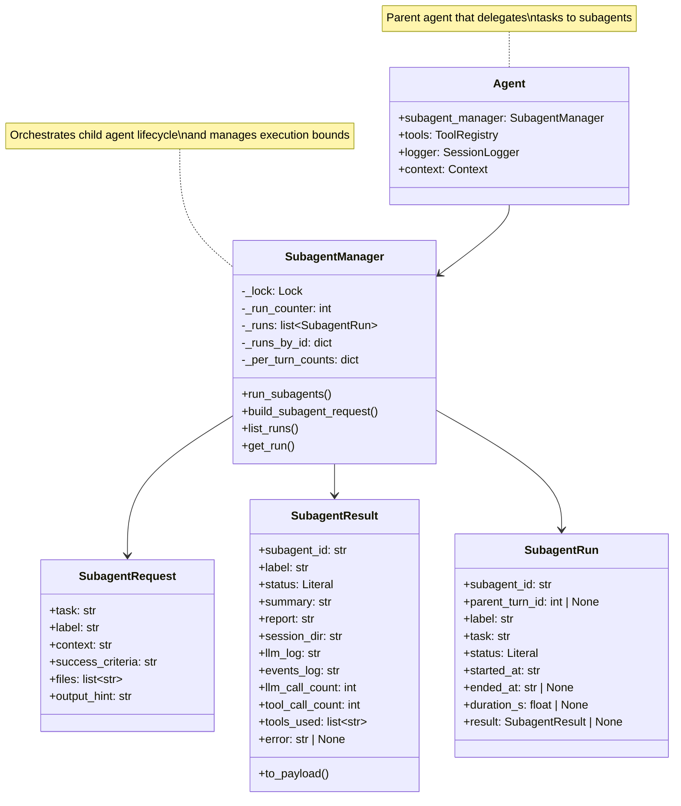
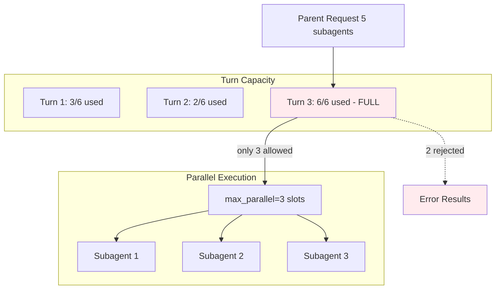
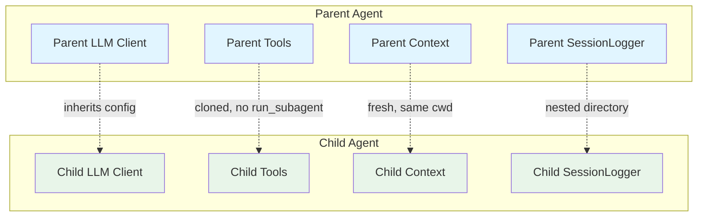
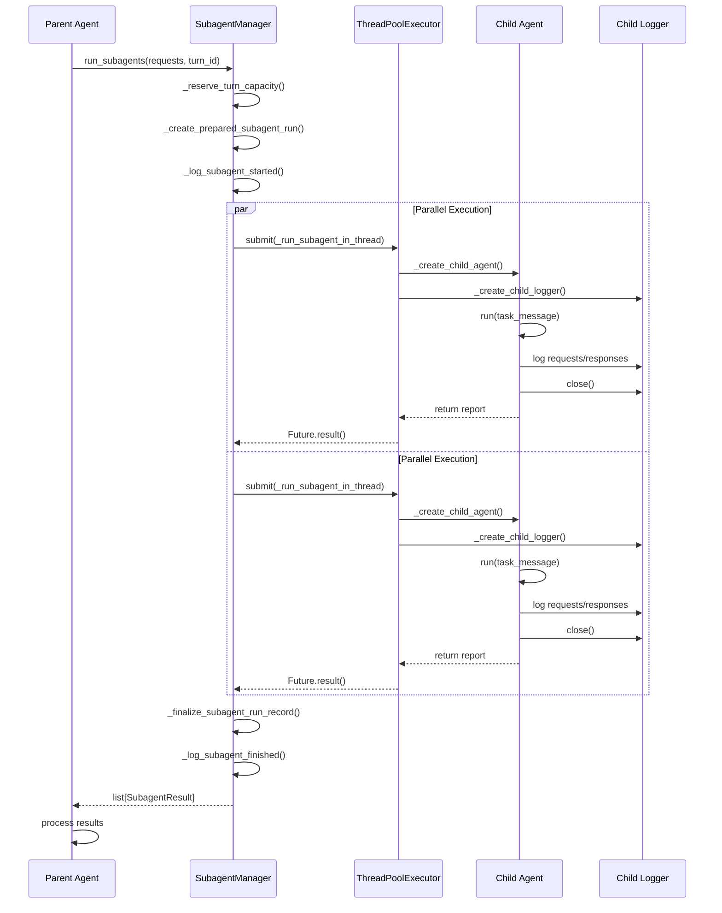

# Local Subagent Runtime

## Abstract

The Local Subagent Runtime is a parallel task delegation system that enables parent agents to spawn child agents for independent subtasks. Child agents run in isolated worker threads with their own contexts, loggers, and LLM clients, while inheriting the parent's repository and tool configuration. The system provides bounded parallel fan-out, nested session logging, and structured result aggregation to enable efficient multi-agent workflows within a single CLI session.

## Table of Contents

- [Background](#background)
- [Architecture Overview](#architecture-overview)
- [Core Components](#core-components)
- [Concurrency Model](#concurrency-model)
- [Isolation and Inheritance](#isolation-and-inheritance)
- [Configuration](#configuration)
- [Logging and Observability](#logging-and-observability)
- [Lifecycle](#lifecycle)
- [Error Handling](#error-handling)
- [Use Cases](#use-cases)
- [Performance Characteristics](#performance-characteristics)
- [Best Practices](#best-practices)
- [API Reference](#api-reference)

## Background

### Motivation

AI agents working with complex software repositories often encounter tasks that can be decomposed into independent subtasks:

- **Parallel Investigation**: Multiple files or components need to be analyzed simultaneously
- **Independent Edits**: Non-conflicting changes can be made in parallel
- **Focused Research**: Deep dives into specific areas without cluttering the main conversation
- **Bounded Delegation**: Subtasks with clear success criteria and output formats

Traditional single-agent approaches force these tasks to execute sequentially, mixing context and increasing token usage. The subagent system solves this by enabling bounded parallel execution with clean isolation boundaries.

### Design Goals

1. **Isolation**: Child agents have fresh contexts, preventing parent context pollution
2. **Parallelism**: Multiple subagents run concurrently within configured bounds
3. **Observability**: Nested session logs provide complete execution traces
4. **Boundedness**: Configuration limits prevent resource exhaustion
5. **Non-recursive**: Child agents cannot spawn further subagents (prevents exponential growth)
6. **Structured Results**: Rich metadata and summaries flow back to the parent

## Architecture Overview

### High-Level Design

The subagent system implements a **fork-join** parallel execution pattern:



### Component Relationships



## Core Components

### SubagentRequest

A `SubagentRequest` is a frozen dataclass that defines the task brief for a child agent. It captures all the information a parent agent provides when delegating work.

```python
@dataclass(frozen=True)
class SubagentRequest:
    """A parent-authored task brief for a child agent."""

    task: str              # The primary delegated task
    label: str             # Short identifier for logging/display
    context: str           # Additional parent context
    success_criteria: str  # Completion contract
    files: list[str]       # File hints (child should inspect)
    output_hint: str       # Desired report format
```

**Field Semantics:**

- `task`: Required. The core instruction for the child agent. Should be self-contained.
- `label`: Optional. Human-readable identifier used in logs and session directories. Defaults to `"subagent-{index}"`.
- `context`: Optional. Supplementary information from the parent's context that may help the child.
- `success_criteria`: Optional. Clear definition of what constitutes successful completion.
- `files`: Optional. List of file paths that may be relevant. The child should still inspect them independently rather than assuming content.
- `output_hint`: Optional. Guidance on the desired format (e.g., "short report", "bullet points", "code examples").

### SubagentResult

A `SubagentResult` is a frozen dataclass that structures the child agent's output for the parent. It contains both the report content and rich execution metadata.

```python
@dataclass(frozen=True)
class SubagentResult:
    """Structured result returned to the parent agent."""

    subagent_id: str              # Unique identifier
    label: str                    # Display label
    status: Literal["completed", "failed", "timed_out"]
    summary: str                  # Executive summary (first paragraph)
    report: str                   # Full report content
    session_dir: str              # Path to child session directory
    llm_log: str                  # Path to child LLM log
    events_log: str               # Path to child events log
    llm_call_count: int           # Number of LLM calls made
    tool_call_count: int          # Number of tool calls made
    tools_used: list[str]         # List of tools used
    error: str | None = None      # Error message if failed
```

**Key Methods:**

- `to_payload()`: Serializes the result to a dictionary for parent tool-result messaging

### SubagentRun

A `SubagentRun` is a mutable dataclass that tracks the in-memory state of a subagent execution. It exists only during the parent session and provides runtime visibility.

```python
@dataclass
class SubagentRun:
    """In-memory tracking for a child run in the current parent session."""

    subagent_id: str
    parent_turn_id: int | None
    label: str
    task: str
    status: Literal["running", "completed", "failed", "timed_out"]
    started_at: str
    ended_at: str | None
    duration_s: float | None
    result: SubagentResult | None
```

**Lifecycle States:**

1. `"running"`: Initial state when subagent is submitted to thread pool
2. `"completed"`: Child agent finished successfully
3. `"failed"`: Child agent raised an exception
4. `"timed_out"`: Child agent exceeded timeout threshold

### SubagentManager

The `SubagentManager` is the central orchestration class that manages the entire subagent lifecycle. It handles request validation, run tracking, thread pool execution, and result aggregation.

```python
class SubagentManager:
    """Create and run local child agents with bounded parallel fan-out."""

    def __init__(
        self,
        *,
        enabled: Optional[bool] = None,
        max_parallel: Optional[int] = None,
        max_per_turn: Optional[int] = None,
        default_timeout_seconds: Optional[int] = None,
    ) -> None:
        """Initialize with configuration overrides."""
```

**Key Responsibilities:**

1. **Capacity Management**: Enforces per-turn and parallel execution limits
2. **Run Tracking**: Maintains in-memory registry of all subagent runs
3. **Thread Pool Execution**: Uses `ThreadPoolExecutor` for parallel execution
4. **Isolation Setup**: Creates child contexts, loggers, and LLM clients
5. **Result Aggregation**: Collects results in input order for parent consumption

## Concurrency Model

### ThreadPoolExecutor Pattern

The subagent system uses Python's `concurrent.futures.ThreadPoolExecutor` for parallel execution. This provides:

- **Bounded Parallelism**: `max_workers` limits concurrent threads
- **Clean Shutdown**: Context manager ensures thread cleanup
- **Future-based Results**: `Future.result(timeout=)` enables timeout handling
- **Exception Isolation**: Exceptions in worker threads don't crash the parent

### Bounded Fan-Out

The system implements two levels of bounds to prevent resource exhaustion:



**Configuration Limits:**

| Parameter | Default | Purpose |
|-----------|---------|---------|
| `max_parallel` | 3 | Maximum concurrent subagent threads |
| `max_per_turn` | 6 | Maximum subagents per parent turn |
| `default_timeout_seconds` | 180 | Per-subagent timeout |

**Capacity Reservation:**

The `_reserve_turn_capacity()` method implements atomic capacity tracking:

```python
def _reserve_turn_capacity(
    self,
    parent_agent,
    parent_turn_id: int | None,
    *,
    requested: int,
) -> int:
    """Reserve the remaining per-turn capacity for subagent runs."""
    if parent_turn_id is None:
        return min(requested, self.max_per_turn)

    key = (parent_agent.context.session_id, parent_turn_id)
    with self._lock:
        used = self._per_turn_counts.get(key, 0)
        remaining = max(self.max_per_turn - used, 0)
        allowed_count = min(requested, remaining)
        self._per_turn_counts[key] = used + allowed_count
        return allowed_count
```

### Thread Safety

The manager uses a `threading.Lock` to protect shared state:

- `_run_counter`: Ensures unique sequential IDs
- `_runs`: Protects the run registry list
- `_runs_by_id`: Protects the run lookup dictionary
- `_per_turn_counts`: Protects the capacity tracking dictionary

All public methods that access shared state use `with self._lock:` for atomicity.

## Isolation and Inheritance

### Child Agent Creation

Child agents are created in worker threads with the following inheritance model:



**What Children Inherit:**

- **LLM Configuration**: Provider, model, base URL from parent's LLM client
- **Repository**: Same working directory as parent
- **Tool Registry**: Cloned from parent, **excluding** `run_subagent` tool
- **Skills**: Reference to parent's skill manager

**What Children Don't Inherit:**

- **Conversation History**: Fresh context with only the task message
- **Session State**: Separate logger with nested directory
- **Context Window**: Independent token usage tracking
- **Subagent Capability**: Cannot spawn further subagents (prevents recursion)

### Tool Registry Cloning

The `clone_tool_registry()` function creates a child-safe tool set:

```python
def clone_tool_registry(source: ToolRegistry, *, include_subagent_tool: bool = True) -> ToolRegistry:
    """Clone a registry by reusing tool instances from an existing registry."""
    registry = ToolRegistry()
    for tool in source._tools.values():
        if not include_subagent_tool and tool.name == "run_subagent":
            continue
        registry.register(tool)
    return registry
```

Child agents are created with `include_subagent_tool=False`, ensuring they cannot spawn further subagents. This prevents exponential recursion and unbounded parallelism.

### Context Isolation

Each child agent gets a fresh `Context` instance:

```python
child_context = Context.create(cwd=str(parent_agent.context.cwd))
```

This ensures:
- **Independent Session IDs**: Unique `session_id` for logging
- **Clean Token Tracking**: No inherited context usage
- **Same Working Directory**: Operates in the same repository

### Logger Isolation

Child loggers are nested under the parent's session directory:

```
logs/
  session-abc123/                    # Parent session
    session.json
    llm.log
    events.jsonl
    subagents/                       # Child sessions
      subagent-research-001-sa_0001/
        session.json                 # Child metadata
        llm.log                      # Child LLM log
        events.jsonl                 # Child events
      subagent-analysis-002-sa_0002/
        ...
```

The child logger is configured with:

```python
child_logger = SessionLogger(
    child_context.session_id,
    log_dir=str(child_log_dir),
    enabled=parent_agent.logger.enabled,
    async_mode=False,
    update_latest_symlinks=False,
    session_kind="subagent",
    parent_session_id=parent_agent.context.session_id,
    parent_turn_id=parent_turn_id,
    subagent_id=subagent_id,
    subagent_label=label,
)
```

**Key Isolation Features:**

- **Nested Directory**: `parent_session_dir/subagents/subagent-{label}-{id}/`
- **Session Kind**: Marked as `"subagent"` for differentiation
- **Parent References**: Links to parent session and turn for traceability
- **No Symlinks**: `update_latest_symlinks=False` prevents disrupting parent symlinks
- **Synchronous Mode**: `async_mode=False` ensures clean shutdown before thread exit

## Configuration

### SubagentConfig

The subagent system is configured through the `SubagentConfig` class, which loads from `config.yaml` and environment variables.

```python
class SubagentConfig(BaseSettings):
    """Local subagent runtime configuration."""

    model_config = SettingsConfigDict(
        env_prefix="SUBAGENTS_",
        env_file=".env",
        env_file_encoding="utf-8",
        case_sensitive=False,
        extra="ignore"
    )

    enabled: bool = Field(default=True)
    max_parallel: int = Field(default=3, ge=1)
    max_per_turn: int = Field(default=6, ge=1)
    default_timeout_seconds: int = Field(default=180, ge=1)
```

### Configuration File

In `config.yaml`:

```yaml
subagents:
  enabled: true
  max_parallel: 3          # Maximum concurrent child agents
  max_per_turn: 6          # Maximum child agents per parent turn
  default_timeout_seconds: 180  # Per-child timeout
```

### Environment Variables

Environment variables override config.yaml values:

```bash
export SUBAGENTS_ENABLED=true
export SUBAGENTS_MAX_PARALLEL=5
export SUBAGENTS_MAX_PER_TURN=10
export SUBAGENTS_DEFAULT_TIMEOUT_SECONDS=300
```

### Runtime Overrides

The `SubagentManager` constructor accepts runtime overrides:

```python
manager = SubagentManager(
    enabled=True,
    max_parallel=5,
    max_per_turn=10,
    default_timeout_seconds=300,
)
```

Priority order (highest to lowest):
1. Constructor parameters
2. Environment variables
3. config.yaml values
4. Class defaults

## Logging and Observability

### Session Directory Structure

The subagent system creates a hierarchical logging structure:

```
logs/
  latest-session -> session-abc123/          # Parent symlink
  session-abc123/                            # Parent session
    session.json                             # Parent metadata
    llm.log                                  # Parent LLM log
    events.jsonl                             # Parent events
    subagents/                               # Child sessions
      subagent-research-001-sa_0001/         # Child 1
        session.json                         # Child metadata
        llm.log                              # Child LLM log
        events.jsonl                         # Child events
      subagent-analysis-002-sa_0002/         # Child 2
        session.json
        llm.log
        events.jsonl
```

### Session Metadata

Each child session has a `session.json` with extended metadata:

```json
{
  "session_id": "def456",
  "session_kind": "subagent",
  "parent_session_id": "abc123",
  "parent_turn_id": 1,
  "subagent_id": "sa_0001_a1b2c3d4",
  "subagent_label": "research-logging",
  "start_time": "2025-03-03T10:15:00",
  "end_time": "2025-03-03T10:15:15",
  "status": "completed",
  "cwd": "/path/to/repo",
  "llm_call_count": 3,
  "tool_call_count": 5,
  "tools_used": ["read_file", "run_command"],
  "provider": "ollama",
  "model": "llama3"
}
```

### Parent Events

The parent logger records subagent lifecycle events in `events.jsonl`:

```json
{"kind": "subagent_started", "timestamp": "...", "details": {"subagent_id": "sa_0001", "label": "research", "task": "...", "session_dir": "...", "llm_log": "...", "events_log": "..."}}
{"kind": "subagent_completed", "timestamp": "...", "details": {"subagent_id": "sa_0001", "label": "research", "duration_s": 15.3, "summary": "..."}}
```

### LLM Log Markers

Child LLM logs include a special marker for request kind:

```
Request Kind: subagent_turn
```

This distinguishes child agent LLM calls from parent agent calls in log analysis.

### Activity Callbacks

The system supports real-time activity callbacks through the `on_event` parameter:

```python
def on_event(event: TurnActivityEvent):
    if event.kind == "subagent_started":
        print(f"Started: {event.details['label']}")
    elif event.kind == "subagent_completed":
        print(f"Finished: {event.details['summary']}")

results = manager.run_subagents(
    parent_agent,
    requests,
    parent_turn_id=turn_id,
    on_event=on_event,
)
```

Supported event kinds:
- `subagent_started`: Fired when child thread begins
- `subagent_completed`: Fired on successful completion
- `subagent_failed`: Fired on exception or timeout

## Lifecycle

### Sequence Diagram



### Detailed Lifecycle

#### 1. Request Creation

The parent agent (or user) creates `SubagentRequest` instances:

```python
request = SubagentRequest(
    task="Analyze the logging system architecture",
    label="research-logging",
    context="Focus on parent-child session relationships",
    success_criteria="Return a concise architectural summary",
    files=["src/logger.py", "src/subagents.py"],
    output_hint="Short report with bullet points",
)
```

#### 2. Batch Submission

The parent agent submits requests to the manager:

```python
results = manager.run_subagents(
    parent_agent=agent,
    requests=[request1, request2, request3],
    parent_turn_id=turn_id,
    on_event=activity_callback,
)
```

#### 3. Capacity Reservation

The manager checks turn capacity:

```python
allowed_count = self._reserve_turn_capacity(
    parent_agent,
    parent_turn_id,
    requested=len(requests),
)
```

If capacity is exceeded, excess requests return error results immediately.

#### 4. Run Preparation

For each allowed request, the manager:

1. Generates unique `subagent_id` and display `label`
2. Creates `SubagentRun` record with status `"running"`
3. Builds nested log paths
4. Constructs the task message for the child

#### 5. Thread Pool Execution

Prepared runs are submitted to a `ThreadPoolExecutor`:

```python
max_workers = min(self.max_parallel, max(len(prepared_subagent_runs), 1))
with ThreadPoolExecutor(max_workers=max_workers, thread_name_prefix="subagent") as executor:
    for prepared_run in prepared_subagent_runs:
        future = executor.submit(self._run_subagent_in_thread, parent_agent, prepared_run, parent_turn_id)
```

#### 6. Child Agent Execution

In the worker thread, the manager:

1. Creates a fresh child context
2. Creates a nested child logger
3. Clones the parent's tool registry (excluding `run_subagent`)
4. Creates a child LLM client with parent's configuration
5. Instantiates a child `Agent` instance
6. Runs the child agent with the task message
7. Captures the report and logger snapshot

#### 7. Result Finalization

After thread completion, the manager:

1. Updates the `SubagentRun` record with status, duration, and result
2. Extracts the executive summary (first paragraph)
3. Builds the `SubagentResult` with full metadata
4. Logs completion events to the parent

#### 8. Result Aggregation

Results are returned to the parent in the original request order:

```python
return [
    results_by_id[prepared_run.run.subagent_id]
    for prepared_run in prepared_subagent_runs
]
```

This ensures deterministic result ordering regardless of completion order.

## Error Handling

### Timeout Handling

When a child agent exceeds the timeout:

```python
try:
    result = future.result(timeout=self.default_timeout_seconds)
except TimeoutError:
    future.cancel()
    result = self._build_timed_out_result(
        prepared_subagent_run,
        timeout_seconds=self.default_timeout_seconds,
    )
```

The timeout result includes:
- `status: "timed_out"`
- `error: "Subagent timed out after {n} seconds"`
- No session logs (thread was cancelled)

### Exception Handling

When a child agent raises an exception:

```python
except Exception as exc:
    snapshot = self._close_child_logger(child_logger, status="error")
    return self._build_failed_result(
        prepared_subagent_run,
        str(exc),
        snapshot=snapshot,
    )
```

The failure result includes:
- `status: "failed"`
- `error: "Subagent failed: {exception message}"`
- Session logs (captured before exception)

### Disabled State

When subagents are disabled in configuration:

```python
if not self.enabled:
    return [self._build_disabled_result(request) for request in requests]
```

The disabled result includes:
- `subagent_id: "disabled"`
- `status: "failed"`
- `error: "Subagents are disabled in the current configuration"`

### Capacity Exceeded

When the per-turn limit is exceeded:

```python
rejected_requests = requests[allowed_count:]
results.extend(
    self._build_rejected_result(
        request,
        "Subagent request rejected because this turn exceeded the configured "
        f"max_per_turn={self.max_per_turn}",
    )
    for request in rejected_requests
)
```

The rejected result includes:
- `subagent_id: "rejected_{random}"`
- `status: "failed"`
- Clear error message explaining the limit

## Use Cases

### Parallel Code Analysis

Analyze multiple components simultaneously:

```python
requests = [
    SubagentRequest(
        task="Analyze the authentication system",
        label="auth-analysis",
        files=["src/auth/*.py"],
        success_criteria="Identify security patterns and potential issues",
    ),
    SubagentRequest(
        task="Analyze the database layer",
        label="db-analysis",
        files=["src/db/*.py"],
        success_criteria="Document query patterns and optimization opportunities",
    ),
    SubagentRequest(
        task="Analyze the API routing",
        label="api-analysis",
        files=["src/api/*.py"],
        success_criteria="Map endpoint structure and middleware usage",
    ),
]

results = manager.run_subagents(parent_agent, requests, parent_turn_id=turn_id)
```

### Independent File Edits

Make non-conflicting edits in parallel:

```python
requests = [
    SubagentRequest(
        task="Add type hints to all functions in logger.py",
        label="type-hints-logger",
        files=["src/logger.py"],
        success_criteria="All functions have complete type annotations",
    ),
    SubagentRequest(
        task="Add docstrings to all classes in context.py",
        label="docstrings-context",
        files=["src/context.py"],
        success_criteria="All classes have Google-style docstrings",
    ),
]

results = manager.run_subagents(parent_agent, requests, parent_turn_id=turn_id)
```

### Focused Research

Deep dive into specific areas without context pollution:

```python
requests = [
    SubagentRequest(
        task="Research the subagent isolation model",
        label="subagent-isolation-research",
        context="Focus on context, logger, and tool inheritance",
        success_criteria="Explain what children inherit and don't inherit",
        output_hint="Technical report with code examples",
    ),
]

results = manager.run_subagents(parent_agent, requests, parent_turn_id=turn_id)
```

## Performance Characteristics

### Parallelism Benefits

The subagent system provides performance benefits when:

1. **Tasks are Independent**: No dependencies between subtasks
2. **I/O Bound**: Tasks involve file operations, API calls, or LLM requests
3. **Non-Overlapping**: Different files or components are analyzed

**Theoretical Speedup**: With `max_parallel=N` and independent I/O-bound tasks, near `N×` speedup is achievable.

### Overhead Costs

The system has inherent overhead:

1. **Thread Creation**: ThreadPoolExecutor overhead (~1-5ms per thread)
2. **Child Agent Initialization**: Context, logger, LLM client creation
3. **Logger Setup**: Nested directory creation and session initialization
4. **Result Serialization**: Building `SubagentResult` with metadata

**Typical Overhead**: 50-200ms per subagent depending on system load.

### Memory Considerations

Each subagent consumes memory for:

- Child agent instance
- Child context and message history
- Child logger buffers
- Child LLM client connection

**Memory Growth**: Approximately `O(threads × avg_child_memory)`. With `max_parallel=3`, typical usage is 50-150MB additional memory.

### Token Efficiency

Subagents can improve token efficiency by:

- **Avoiding Context Mixing**: Each subtask gets a focused context
- **Parallel Execution**: Parent doesn't need to sequentially process each subtask
- **Clean Summaries**: Executive summaries reduce parent context load

**Token Savings**: 20-40% reduction in parent token usage for multi-step tasks.

## Best Practices

### Task Design

**DO:**
- Make tasks self-contained and independent
- Provide clear success criteria
- Include file hints when relevant
- Specify desired output format

**DON'T:**
- Create tasks with dependencies between them
- Make assumptions about parent context in the child
- Delegate trivial tasks (overhead outweighs benefit)
- Spawn subagents for single operations

### Label Selection

Use descriptive, filesystem-safe labels:

```python
# Good
label="auth-system-analysis"
label="database-migration-plan"

# Avoid
label="a"  # Not descriptive
label="task with spaces and / slashes"  # Not filesystem-safe
```

Labels are sanitized with `_sanitize_path_fragment()`:

```python
def _sanitize_path_fragment(value: str) -> str:
    """Convert a label into the filesystem-safe fragment used by child session dirs."""
    sanitized = "".join(ch if ch.isalnum() or ch in "._-" else "-" for ch in value.strip())
    sanitized = sanitized.strip("-")
    return sanitized or "subagent"
```

### Capacity Planning

Configure limits based on:

1. **Available Memory**: More threads = more memory
2. **LLM Rate Limits**: Respect provider rate limits
3. **Task Complexity**: Longer tasks may need fewer parallel slots
4. **Repository Size**: Larger repos may benefit from more parallel analysis

**Starting Configuration:**
```yaml
subagents:
  max_parallel: 3      # Conservative for 8GB RAM
  max_per_turn: 6      # Allows batching
  default_timeout_seconds: 180  # 3 minutes per task
```

### Error Recovery

Handle subagent failures gracefully:

```python
results = manager.run_subagents(parent_agent, requests, parent_turn_id=turn_id)

for result in results:
    if result.status == "completed":
        print(f"✓ {result.label}: {result.summary}")
    elif result.status == "timed_out":
        print(f"⏱ {result.label}: Timed out")
    elif result.status == "failed":
        print(f"✗ {result.label}: {result.error}")
        # Optionally: retry with simpler task, or handle manually
```

### Logging Strategy

Leverage nested logs for debugging:

```python
# Find child session directories
for result in results:
    if result.status == "failed":
        print(f"Check logs: {result.session_dir}")
        # Read child LLM log for details
        with open(result.llm_log) as f:
            child_log = f.read()
            # Analyze what went wrong
```

## API Reference

### SubagentManager

#### Constructor

```python
SubagentManager(
    *,
    enabled: Optional[bool] = None,
    max_parallel: Optional[int] = None,
    max_per_turn: Optional[int] = None,
    default_timeout_seconds: Optional[int] = None,
) -> SubagentManager
```

**Parameters:**
- `enabled`: Enable/disable subagent system
- `max_parallel`: Maximum concurrent subagent threads
- `max_per_turn`: Maximum subagents per parent turn
- `default_timeout_seconds`: Per-subagent timeout in seconds

#### Methods

##### run_subagents

```python
def run_subagents(
    self,
    parent_agent,
    requests: list[SubagentRequest],
    *,
    parent_turn_id: int | None,
    on_event=None,
) -> list[SubagentResult]
```

Run one or more subagents through the worker-thread path.

**Parameters:**
- `parent_agent`: The parent agent instance
- `requests`: List of subagent requests to execute
- `parent_turn_id`: Current turn ID in parent session
- `on_event`: Optional callback for activity events

**Returns:**
- List of `SubagentResult` in request order

**Raises:**
- `ValueError`: If requests list is empty

##### build_subagent_request

```python
def build_subagent_request(
    self,
    arguments: dict[str, object],
) -> SubagentRequest
```

Normalize tool-call arguments into a subagent request.

**Parameters:**
- `arguments`: Raw tool call arguments from LLM

**Returns:**
- `SubagentRequest` instance

**Raises:**
- `ValueError`: If required `task` parameter is missing

##### list_runs

```python
def list_runs(self) -> list[SubagentRun]
```

Return runs created in this top-level session.

**Returns:**
- List of `SubagentRun` instances

##### get_run

```python
def get_run(self, subagent_id: str) -> SubagentRun | None
```

Return one run by ID.

**Parameters:**
- `subagent_id`: The subagent ID to look up

**Returns:**
- `SubagentRun` instance or `None` if not found

### SubagentRequest

```python
@dataclass(frozen=True)
class SubagentRequest:
    task: str              # Required
    label: str             # Optional display label
    context: str           # Optional parent context
    success_criteria: str  # Optional completion criteria
    files: list[str]       # Optional file hints
    output_hint: str       # Optional output format hint
```

### SubagentResult

```python
@dataclass(frozen=True)
class SubagentResult:
    subagent_id: str
    label: str
    status: Literal["completed", "failed", "timed_out"]
    summary: str
    report: str
    session_dir: str
    llm_log: str
    events_log: str
    llm_call_count: int
    tool_call_count: int
    tools_used: list[str]
    error: str | None = None

    def to_payload(self) -> dict[str, object]
```

## References

- [Source Code](/Volumes/CaseSensitive/nano-coder/src/subagents.py)
- [Tests](/Volumes/CaseSensitive/nano-coder/tests/test_subagents.py)
- [Tool Implementation](/Volumes/CaseSensitive/nano-coder/src/tools/subagent.py)
- [Agent Integration](/Volumes/CaseSensitive/nano-coder/src/agent.py)
- [Configuration](/Volumes/CaseSensitive/nano-coder/src/config.py)
