# Nano-Coder Design Overview

## Abstract

Nano-Coder is a terminal-based AI coding assistant that uses a ReAct (Reasoning + Acting) pattern to orchestrate tool use, skill loading, subagent delegation, and context management. This document provides a high-level architectural overview of how the system works, helping developers understand the core components, data flows, and design patterns that make Nano-Coder extensible and maintainable.

After reading this document, you should understand:
- How the main agent loop works using the ReAct pattern
- How tools are registered, called, and their results flow back to the model
- How skills are discovered, loaded, and integrated into the conversation
- How subagents delegate work to child agents with bounded parallelism
- How context compaction manages long sessions within finite context windows
- How all these components work together in a cohesive system

## Section 1: System Overview

### What is Nano-Coder?

Nano-Coder is a terminal-based coding agent that works directly inside your repository. It combines:
- An OpenAI-compatible LLM client for reasoning
- A tool system for reading files, writing files, running commands, and more
- A skill system for domain-specific instruction bundles
- A subagent system for parallel delegated tasks
- Context compaction for long-running sessions

The system is designed for practical repository work: you get a live activity feed while the agent is running, structured per-session logs after each turn, and slash commands for inspecting tools, skills, and context usage.

### Core Design Philosophy

Nano-Coder is built on three key principles:

**1. ReAct Loop with Tool Use**
The agent follows a Reasoning + Acting loop: it thinks about what to do, calls tools to gather information or perform actions, observes the results, and continues until it can provide a final answer. This iterative approach allows the agent to break complex tasks into smaller steps.

**2. Skill-Based Extension**
Skills provide a Codex-style bundle format for domain-specific instructions. The system separates discovery (what skills are available) from loading (when their full content enters context), enabling efficient management of specialized knowledge.

**3. Bounded Delegation**
Subagents allow the system to parallelize independent tasks while maintaining control. Parent agents dispatch work to child agents that run in isolated contexts, then aggregate results with configurable limits on parallelism and per-turn usage.

### Architectural Goals

- **Extensibility**: New tools, skills, and integrations can be added without modifying core logic
- **Modularity**: Each component has clear responsibilities and well-defined interfaces
- **Observability**: Every action is logged, and the CLI provides live feedback on what the agent is doing
- **Resource Awareness**: The system tracks context usage and can compact long sessions to stay within limits

## Section 2: Core Components

### Agent (src/agent.py)

The Agent class is the main orchestrator. It implements the ReAct loop, coordinates between the LLM, tools, skills, and other components, and manages the conversation state.

**Key responsibilities:**
- Build the system prompt with tool schemas and skill catalog
- Execute the main turn loop (LLM call → tool execution → LLM call → ...)
- Handle skill mentions and preloading
- Check for context compaction before each turn
- Track tools and skills used during the turn
- Emit activity events for the CLI display

### Context (src/context.py)

The Context class represents the session state. It holds the conversation history, active skills, rolling summary, and context usage metrics.

**Key data:**
- `messages`: List of conversation messages (user, assistant, tool)
- `active_skills`: List of skills pinned for the session
- `summary`: Rolling summary that replaces older raw turns
- `last_prompt_tokens`: Token count from the most recent LLM call
- `auto_compaction_enabled`: Whether auto-compaction is active

**Key operations:**
- Add messages to the conversation
- Get complete turns (alternating user/assistant pairs)
- Activate/deactivate pinned skills
- Replace message history with retained turns after compaction

### ToolRegistry (src/tools/__init__.py)

The ToolRegistry manages available tools and provides their schemas to the LLM.

**Key operations:**
- Register tools by name
- Retrieve tool schemas in OpenAI function calling format
- Execute tools by name with arguments

**Built-in tools:**
- `read_file`: Read file contents
- `write_file`: Write content to files
- `bash`: Run shell commands
- `load_skill`: Load a skill's full content
- `run_subagent`: Delegate work to a child agent

### SkillManager (src/skills.py)

The SkillManager discovers, parses, and formats skill bundles from the filesystem.

**Discovery locations:**
- `.nano-coder/skills/` (repo-local)
- `~/.nano-coder/skills/` (user-global)

**Skill format:**
- YAML frontmatter with `name` and `description`
- Markdown body with instructions
- Optional directories: `scripts/`, `references/`, `assets/`

**Key operations:**
- Discover skills from filesystem
- Extract skill mentions from user text (`$skill-name` syntax)
- Build preload messages for mentioned or pinned skills
- Format skill content for tool results

### SubagentManager (src/subagents.py)

The SubagentManager creates and runs child agents with bounded parallel fan-out.

**Key features:**
- Parent-child relationship with inheritance
- Worker thread execution using ThreadPoolExecutor
- Bounded parallelism (max_parallel, max_per_turn limits)
- Child agent isolation (separate context, logger, LLM client)
- Result aggregation and summary

### ContextCompactionManager (src/context_compaction.py)

The ContextCompactionManager manages rolling summaries to keep long sessions within context limits.

**Key features:**
- Threshold-based auto-compaction
- Rolling summary approach (compact old turns, keep recent ones raw)
- Adaptive retention (min_recent_turns)
- Summary generation with fallback
- Integration with context usage tracking

### SessionLogger (src/logger.py)

The SessionLogger writes per-session logs to disk for debugging and analysis.

**Log outputs:**
- `session.json`: Session metadata and aggregate counts
- `llm.log`: Human-readable execution timeline
- `events.jsonl`: Structured event stream
- `artifacts/`: Spilled large payloads
- `subagents/`: Nested child-agent session directories

## Section 3: The Main Agent Loop (ReAct Pattern)

The agent follows a ReAct (Reasoning + Acting) pattern that iterates between thinking and acting until it reaches a final answer.

### Turn Lifecycle

A single turn from user input to final response follows these steps:

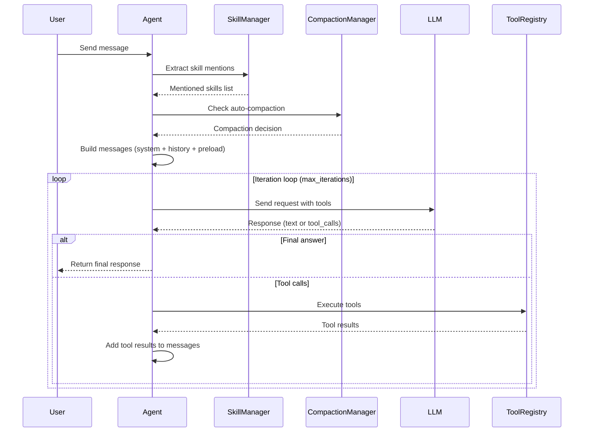

### Iteration Details

Each iteration within the turn:

1. **Build messages**: Assemble the complete message list including:
   - System prompt with tool schemas and skill catalog
   - Rolling summary (if present)
   - Pinned skill preloads
   - Conversation history
   - Current user message

2. **LLM call**: Send the messages to the LLM with tool schemas

3. **Process response**:
   - If `finish_reason == "tool_calls"`: Execute tools and add results to messages
   - If `finish_reason == "stop"`: Return the final answer

4. **Loop or exit**: Continue to next iteration or return final answer

### Message Flow

The conversation grows through the turn:

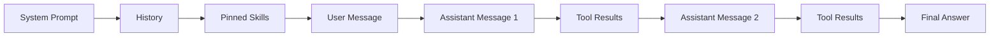

Each tool result is added as a new message, allowing the model to see the full history of actions and their outcomes.

## Section 4: Tool Calling System

Tools are the primary way the agent interacts with the world. The tool system provides a consistent interface for everything from reading files to delegating work to subagents.

### Tool Registration

Tools are registered at startup in the ToolRegistry:

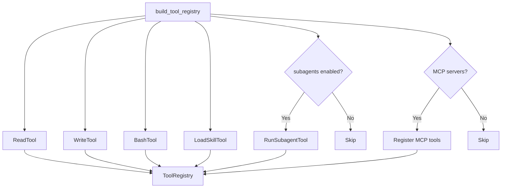

### Tool Schema Format

Tools expose their interface using OpenAI's function calling schema:

```json
{
  "type": "function",
  "function": {
    "name": "read_file",
    "description": "Read the contents of a file",
    "parameters": {
      "type": "object",
      "properties": {
        "file_path": {
          "type": "string",
          "description": "Path to the file to read"
        }
      },
      "required": ["file_path"]
    }
  }
}
```

### Tool Execution Flow

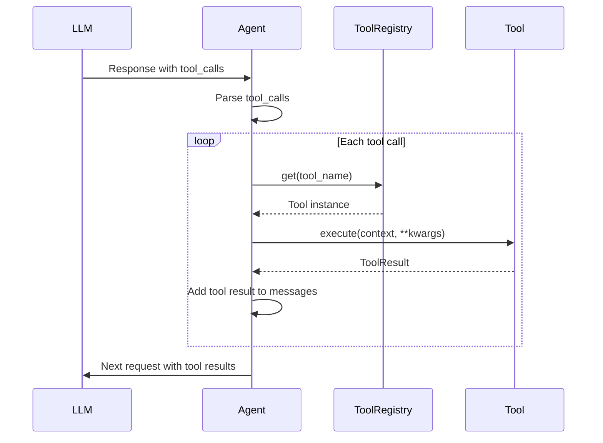

### Tool Result Format

Tool results return a standardized `ToolResult`:

```python
@dataclass
class ToolResult:
    success: bool
    data: Optional[Any] = None
    error: Optional[str] = None
```

Results are added to the conversation as tool role messages:

```json
{
  "role": "tool",
  "tool_call_id": "call_abc123",
  "content": "{\"success\": true, \"data\": \"file contents\"}"
}
```

### Built-in Tools

**read_file**: Read file contents relative to cwd
- Parameters: `file_path` (string)
- Returns: File contents as string

**write_file**: Write content to a file
- Parameters: `file_path` (string), `content` (string)
- Returns: Success confirmation

**bash**: Execute a shell command
- Parameters: `cmd` (string)
- Returns: stdout, stderr, exit code

**load_skill**: Load a skill's full content
- Parameters: `skill_name` (string)
- Returns: Formatted skill payload

**run_subagent**: Delegate work to a child agent
- Parameters: `task`, `context`, `files`, `success_criteria`, `output_hint`
- Returns: SubagentResult with summary and report

## Section 5: Skill System

Skills provide a Codex-style bundle format for domain-specific instructions. They allow the agent or user to bring in specialized knowledge without bloating the system prompt.

### Skill Discovery

Skills are discovered from two locations:

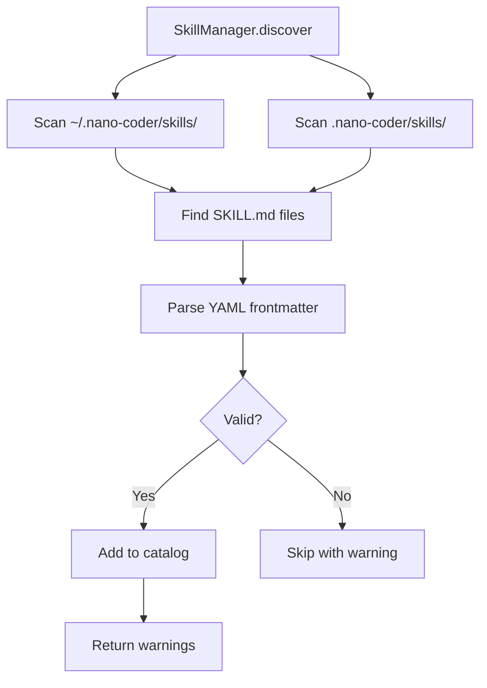

### Skill Format

Each skill is a directory with a `SKILL.md` file:

```
skill-name/
├── SKILL.md
├── scripts/
├── references/
├── assets/
└── agents/
```

`SKILL.md` format:

```markdown
---
name: pdf
description: Use for PDF tasks where layout and rendering matter
metadata:
  short-description: PDF workflows
---

Use `pdfplumber`, `pypdf`, and rendered page checks when layout matters.
```

### Skill Loading Paths

Skills enter the conversation through three paths:

```mermaid
graph TD
    A[Skill Loading] --> B[Mention Syntax]
    A --> C[Pinned Skills]
    A --> D[Agent Load]

    B --> E[$skill-name in user message]
    E --> F[Extract mentions]
    F --> G[Build preload messages]

    C --> H[/skill use command]
    H --> I[Add to active_skills]
    I --> G

    D --> J[Agent calls load_skill tool]
    J --> K[Return skill payload]
    K --> L[Add to conversation]

    G --> M[Inject before next LLM call]
    L --> M
```

### Skill Catalog vs. Full Content

The system separates skill discovery from loading:

- **Skill catalog**: Name + short description (always in system prompt)
- **Full skill content**: Complete instructions (loaded on demand)

This keeps the system prompt small while making full skill content available when needed.

### Skill Preload Messages

When a skill is mentioned or pinned, it's injected as synthetic messages:

```json
[
  {
    "role": "assistant",
    "content": "",
    "tool_calls": [{
      "id": "skill_preload_1_pdf",
      "type": "function",
      "function": {
        "name": "load_skill",
        "arguments": "{\"skill_name\": \"pdf\"}"
      }
    }]
  },
  {
    "role": "tool",
    "tool_call_id": "skill_preload_1_pdf",
    "content": "{...skill payload...}"
  }
]
```

This makes it appear as if the agent had already loaded the skill, maintaining conversation consistency.

## Section 6: Subagent System

Subagents allow the system to parallelize independent tasks while maintaining control over resource usage and ensuring results are properly aggregated.

### When to Use Subagents

Subagents are ideal for:
- Parallelizable independent tasks (e.g., analyze multiple files)
- Isolated work that doesn't need parent context
- Bounded delegation with timeout limits

### Subagent Flow

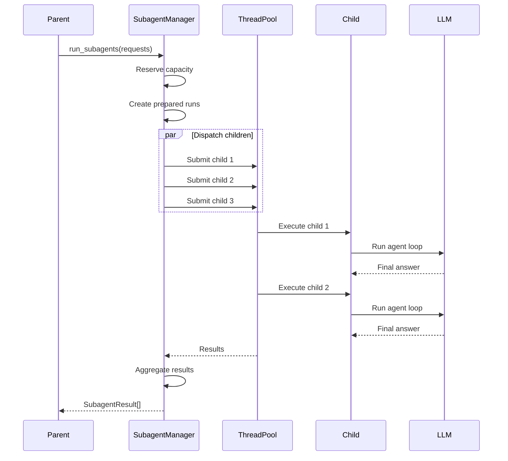

### Parent-Child Relationship

Child agents are isolated but inherit some configuration:

- **Inherited**: LLM provider/model, working directory, tool registry (without subagent tool)
- **Fresh**: Empty context, separate logger, separate conversation history
- **Constraints**: Cannot spawn additional subagents

### Bounded Parallelism

The system enforces two limits:

1. **max_parallel**: Maximum concurrent subagents across all turns
2. **max_per_turn**: Maximum subagents per parent turn

This prevents runaway parallelism and ensures predictable resource usage.

### Result Aggregation

Results are returned in input order regardless of completion order:

```python
results_by_id = {}  # Map subagent_id -> result
for future in futures:
    result = future.result()
    results_by_id[result.subagent_id] = result

# Return in original request order
return [results_by_id[prepared_run.subagent_id] for prepared_run in prepared_runs]
```

### SubagentResult Structure

Each subagent returns a structured result:

```python
@dataclass
class SubagentResult:
    subagent_id: str
    label: str
    status: Literal["completed", "failed", "timed_out"]
    summary: str  # Executive summary (first paragraph)
    report: str   # Full report
    session_dir: str
    llm_log: str
    events_log: str
    llm_call_count: int
    tool_call_count: int
    tools_used: list[str]
    error: str | None = None
```

## Section 7: Context Compaction

Context compaction manages long sessions by replacing older conversation turns with a rolling summary, keeping recent turns in their raw form.

### Why Compaction is Needed

LLMs have finite context windows (e.g., 128K tokens). Long sessions can exceed these limits, causing:
- Truncation of recent messages
- Loss of important context
- Failure to process new requests

Compaction solves this by:
- Summarizing older turns into a concise format
- Keeping recent turns raw for immediate context
- Merging summaries across compactions

### Compaction Flow

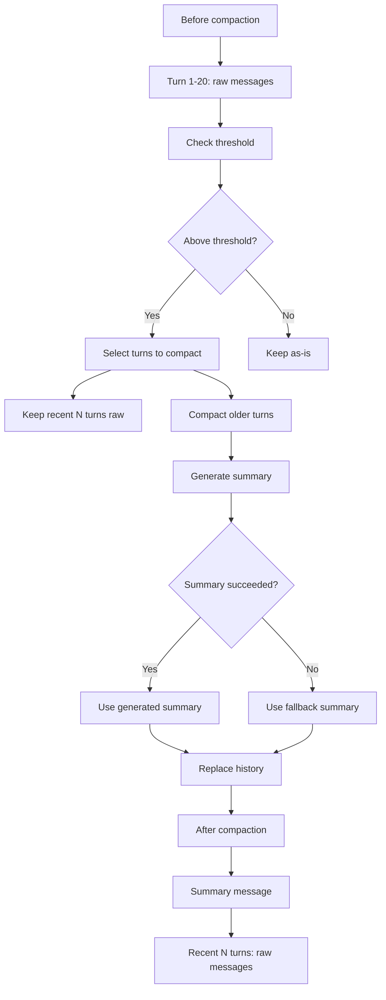

### Compaction Decision

The system checks before each turn:

```python
decision = compaction_manager.build_decision(agent)

if decision.should_compact:
    result = compaction_manager.compact_now(
        agent,
        reason="threshold_reached",
        turn_id=turn_id,
    )
```

### Turn Selection

Compaction uses adaptive retention:

1. **minimum_retention**: Always keep at least N recent turns
2. **target_tokens**: Aim for this token count after compaction
3. **evictable_turns**: Older turns that can be compacted

```python
effective_retention = min(min_recent_turns, len(turns) - 1)
retained_turns = turns[-effective_retention:]
evictable_turns = turns[:-effective_retention]
```

### Summary Generation

The summarizer LLM call receives:

```json
{
  "previous_summary": "...",
  "turns_to_compact": [
    {
      "turn_index": 1,
      "user": "...",
      "assistant": "..."
    }
  ],
  "active_skills": ["pdf"],
  "reason": "threshold_reached"
}
```

And returns a structured summary:

```markdown
Conversation summary for earlier turns:

## Goal
- Extract emails from PDF documents

## Instructions
- Use pdfplumber for layout-aware extraction
- Validate email patterns with regex

## Discoveries
- Documents use varied formats
- Some emails are in tables

## Accomplished
- Extracted 127 emails from 3 documents
- Created validation script

## Relevant files / directories
- docs/documents/
- scripts/extract_emails.py
```

### Summary Lifecycle

Summaries evolve across compactions:

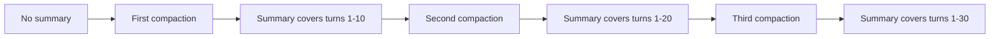

Each compaction:
1. Merges the previous summary with new turns
2. Increments `compaction_count`
3. Updates `covered_turn_count`
4. Replaces the summary in context

## Section 8: Integration and Data Flow

All components connect through the Agent class, which orchestrates the flow of data between them.

### Component Relationships

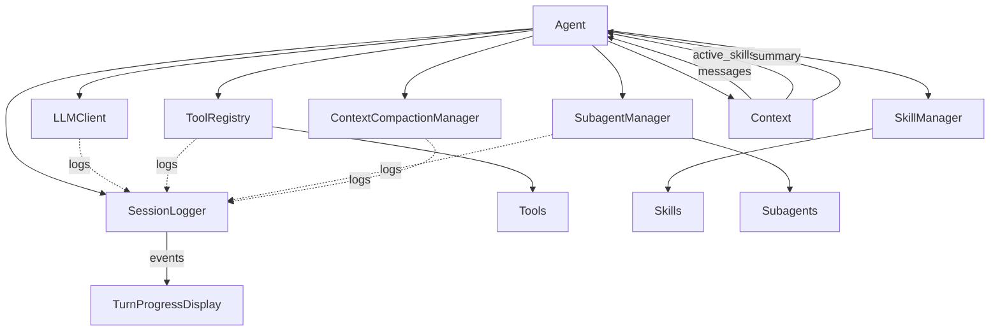

### Context as Central Hub

The Context object is shared across components and holds:

- **Conversation state**: Messages, summary, skills
- **Usage tracking**: Token counts, context window
- **Configuration**: Auto-compaction enabled

```python
context = Context.create(cwd=".")
context.add_message("user", "Hello")
context.add_message("assistant", "Hi there!")
context.activate_skill("pdf")
```

### Event Flow to CLI

Activity events flow from components to the CLI display:

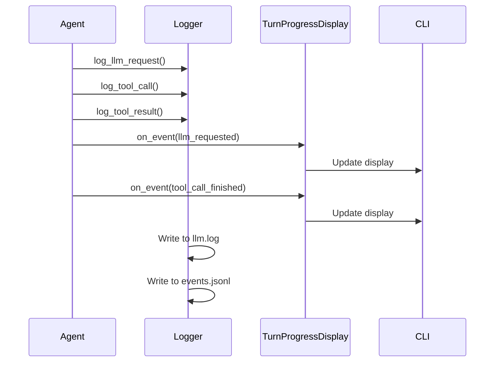

### Request Kind Tracking

The system tracks different request types:

- `agent_turn`: Main agent iterations
- `subagent_turn`: Child agent iterations
- `context_compaction`: Summary generation

This allows filtering and analysis in logs.

## Section 9: Key Design Patterns

### ReAct Loop

The agent uses the ReAct (Reasoning + Acting) pattern:

1. **Reason**: LLM generates thoughts or tool calls
2. **Act**: Execute tools to gather information
3. **Observe**: Add tool results to conversation
4. **Repeat**: Loop until final answer

This pattern breaks complex tasks into iterative steps.

### Tool Use Abstraction

All tools implement the same interface:

```python
class Tool:
    name: str
    description: str
    parameters: dict

    def execute(self, context: Context, **kwargs) -> ToolResult:
        raise NotImplementedError
```

This consistency allows the agent to call any tool through the same mechanism.

### Skill Bundle Pattern

Skills follow the Codex bundle pattern:

- **SKILL.md**: Primary instruction file
- **scripts/**: Helper scripts
- **references/**: Documentation
- **assets/**: Images, diagrams

This structure keeps related materials together.

### Fork-Join for Subagents

Subagents use fork-join parallelism:

1. **Fork**: Parent dispatches multiple children
2. **Execute**: Children run independently
3. **Join**: Parent aggregates results

This balances parallelism with control.

### Rolling Summaries

Context compaction uses rolling summaries:

- Keep recent turns raw for immediacy
- Compact older turns into a summary
- Merge summaries across compactions

This preserves important context while managing token usage.

### Event-Driven Architecture

Activity events drive the CLI display:

```python
TurnActivityEvent(
    kind="tool_call_finished",
    iteration=1,
    worker_id="main",
    timestamp="...",
    details={"tool": "read_file", "duration": 0.5}
)
```

This provides real-time feedback without blocking.

## Section 10: Example Session Flow

Let's walk through a complete example showing how all components work together.

### Scenario

User request: "Use the pdf skill to read document.pdf and extract all email addresses"

### Complete Flow

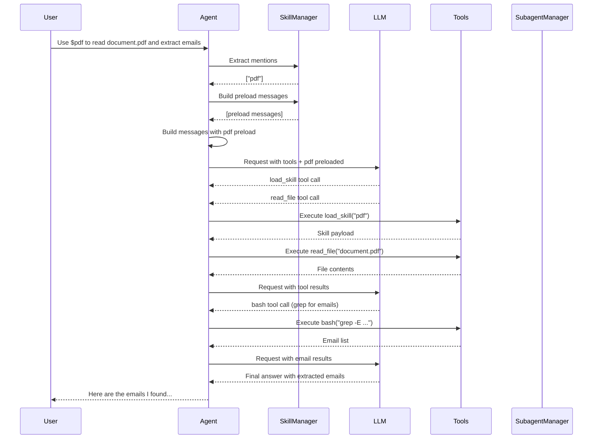

### Step-by-Step Breakdown

**Step 1: User Input**
```
Use $pdf to read document.pdf and extract emails
```

**Step 2: Skill Mention Extraction**
- Agent detects `$pdf` mention
- SkillManager returns ["pdf"]
- Builds preload messages for pdf skill

**Step 3: Build Messages**
```
[
  {role: "system", content: "...tool schemas..."},
  {role: "assistant", tool_calls: [{name: "load_skill", ...}]},
  {role: "tool", content: "...pdf skill payload..."},
  {role: "user", content: "Use pdf to read document.pdf..."}
]
```

**Step 4: First LLM Call**
- Model receives tool schemas + pdf skill
- Requests load_skill tool (redundant but allowed)
- Requests read_file tool

**Step 5: Tool Execution**
- load_skill returns pdf skill payload
- read_file returns document.pdf contents

**Step 6: Second LLM Call**
- Model sees pdf skill + document contents
- Requests bash tool with grep command

**Step 7: Extract Emails**
- bash executes grep for email patterns
- Returns list of found emails

**Step 8: Third LLM Call**
- Model sees extracted emails
- Returns final answer with formatted results

**Step 9: Final Response**
```
I found 27 email addresses in document.pdf:

- alice@example.com
- bob@company.org
- ...

The emails were extracted using pdfplumber and regex validation.
```

### Logs Generated

The session creates:
- `logs/session-TIMESTAMP/`
  - `session.json`: Metadata (3 LLM calls, 3 tool calls)
  - `llm.log`: Full execution timeline
  - `events.jsonl`: Structured event stream

### Key Observations

1. **Skill preloading**: `$pdf` injected the skill before the first LLM call
2. **Tool iteration**: Multiple rounds of tool use (load_skill → read_file → bash)
3. **Context growth**: Each tool result added to conversation
4. **Logging**: Every action recorded for debugging
5. **Final answer**: Model synthesized results into coherent response

## Conclusion

Nano-Coder's architecture is built on a few key patterns:

- **ReAct loop** for iterative reasoning and acting
- **Tool abstraction** for consistent interfaces
- **Skill bundles** for domain-specific knowledge
- **Bounded delegation** for parallel work
- **Rolling summaries** for long sessions
- **Event-driven updates** for live feedback

These patterns work together to create an extensible, observable, and resource-aware coding assistant that can work effectively inside your repository.

The separation of concerns—Agent for orchestration, ToolRegistry for tools, SkillManager for skills, SubagentManager for delegation, ContextCompactionManager for summaries—makes the system modular and maintainable. Each component has clear responsibilities and well-defined interfaces, allowing developers to add new features without modifying core logic.

The comprehensive logging and event system provides visibility into every action, making it easy to debug issues and understand what the agent is doing at any point in time.

This design enables Nano-Coder to handle complex coding tasks while staying within resource limits and providing a good user experience.
