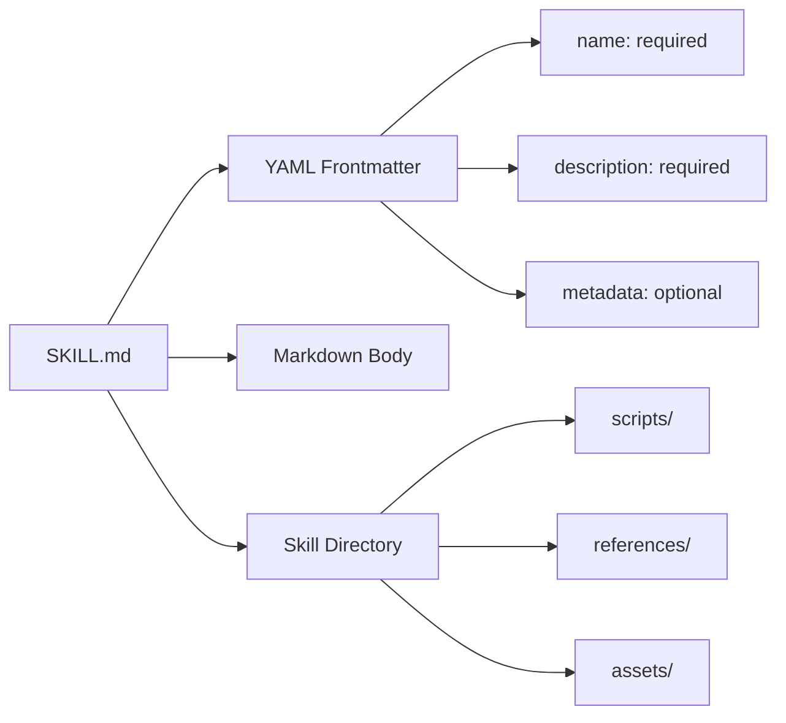
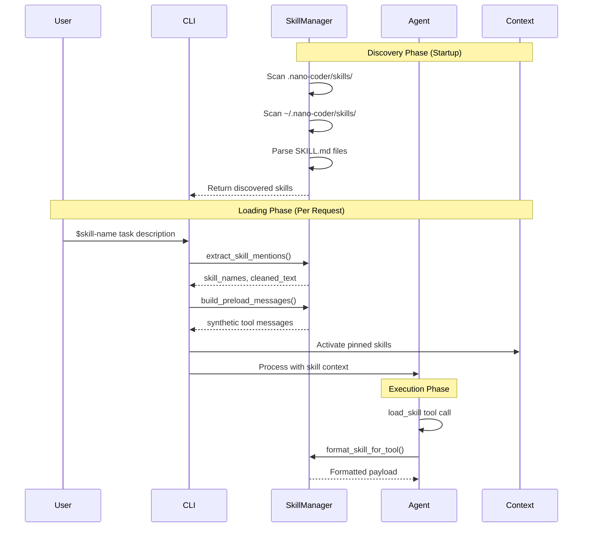

# Nano-Coder Skill System

## Abstract

The Nano-Coder Skill System provides a modular, extensible mechanism for discovering, loading, and applying domain-specific expertise to AI agent operations. Skills are Codex-style knowledge bundles that encapsulate specialized instructions, workflows, and resources without hardcoding domain logic into the agent core. This document describes the architecture, components, and operational patterns of the skill system.

## Table of Contents

1. [Background and Problem Statement](#background-and-problem-statement)
2. [Architecture Overview](#architecture-overview)
3. [Core Components](#core-components)
4. [Skill Bundle Structure](#skill-bundle-structure)
5. [Discovery Process](#discovery-process)
6. [Skill Loading Mechanisms](#skill-loading-mechanisms)
7. [Integration Points](#integration-points)
8. [CLI Commands](#cli-commands)
9. [Resource Management](#resource-management)
10. [Token Budgeting](#token-budgeting)
11. [Best Practices](#best-practices)
12. [Examples](#examples)

---

## Background and Problem Statement

### The Challenge

AI agents operating across diverse domains face a fundamental tension:

- **Generalization vs. Specialization**: Generic instructions lack domain-specific nuance, while hardcoded specializations reduce flexibility and increase maintenance burden.
- **Context Budgeting**: Domain expertise consumes valuable token budget, but omitting it leads to suboptimal outcomes.
- **Knowledge Distribution**: Best practices, workflows, and domain conventions should be shareable across teams and projects without code changes.

### The Solution: Skills

Skills address these challenges by:

1. **Decoupling expertise** from agent logic through external, versionable skill bundles
2. **Just-in-time loading** of domain instructions only when needed via explicit mentions or pinning
3. **Resource packaging** of supporting materials (scripts, references, assets) alongside instructions
4. **Multi-source discovery** from both repository-local and user-global skill directories
5. **Explicit activation** through user-controlled syntax rather than implicit inference

This design enables Nano-Coder to maintain a small, focused core while supporting unlimited domain extensions through skill bundles.

---

## Architecture Overview

### System Architecture

```mermaid
graph TB
    subgraph "Discovery Phase"
        SM[SkillManager]
        SR1[Repo Skills: .nano-coder/skills/]
        SR2[User Skills: ~/.nano-coder/skills/]
        SM --> SR1
        SM --> SR2
    end

    subgraph "Activation Phase"
        UM[User Message]
        EM[Extract Mentions]
        BP[Build Preload]
        SM --> EM
        EM --> BP
    end

    subgraph "Execution Phase"
        AG[Agent]
        LT[LoadSkillTool]
        CTX[Context]
        AG --> LT
        LT --> SM
        CTX --> AG
    end

    subgraph "CLI Interface"
        CMD[/skill commands]
        CMD --> SM
        CMD --> CTX
    end

    SR1 --> SM
    SR2 --> SM
    BP --> AG
    UM --> EM
```

### Skill Bundle Structure



### Discovery and Loading Flow



---

## Core Components

### SkillSpec

`SkillSpec` is a dataclass representing a discovered skill bundle with all metadata and resources.

**Location**: `/Volumes/CaseSensitive/nano-coder/src/skills.py`

**Attributes**:
- `name: str` - Unique identifier for the skill
- `description: str` - Full description from frontmatter
- `short_description: str` - Brief description for listings (from metadata.short-description or falls back to description)
- `body: str` - Markdown instruction body (after frontmatter)
- `root_dir: Path` - Absolute path to skill directory
- `skill_file: Path` - Absolute path to SKILL.md
- `source: SkillSource` - Either "repo" or "user"
- `catalog_visible: bool` - Whether to show in system prompt catalog
- `scripts: List[Path]` - Recursive inventory of files under scripts/
- `references: List[Path]` - Recursive inventory of files under references/
- `assets: List[Path]` - Recursive inventory of files under assets/

**Properties**:
- `body_line_count: int` - Number of lines in body for budgeting
- `is_oversized: bool` - Whether body exceeds MAX_SKILL_BODY_LINES (500)

**Example**:
```python
skill = SkillSpec(
    name="pdf",
    description="Handle PDF workflows with visual checks",
    short_description="PDF workflows",
    body="Prefer visual PDF verification over text extraction...",
    root_dir=Path("/repo/.nano-coder/skills/pdf"),
    skill_file=Path("/repo/.nano-coder/skills/pdf/SKILL.md"),
    source="repo",
    catalog_visible=True,
    scripts=[],
    references=[],
    assets=[]
)
```

### SkillManager

`SkillManager` orchestrates skill discovery, parsing, and formatting for agent consumption.

**Location**: `/Volumes/CaseSensitive/nano-coder/src/skills.py`

**Key Methods**:

#### `__init__(repo_root, user_root)`
Initializes the manager with two discovery roots:
- `repo_root`: Project repository (defaults to cwd), scans `.nano-coder/skills/`
- `user_root`: User home directory (defaults to `~/.nano-coder/skills`)

#### `discover() -> List[str]`
Scans both roots recursively for `SKILL.md` files and returns warnings.

**Process**:
1. Scan user root first (lower priority)
2. Scan repo root second (higher priority, overrides)
3. Parse each SKILL.md with YAML frontmatter validation
4. Emit warnings for duplicates, oversized bodies, parse errors
5. Build internal `_skills` dictionary

**Returns**: List of warning strings

#### `list_skills() -> List[SkillSpec]`
Returns all discovered skills sorted by name.

#### `list_catalog_skills() -> List[SkillSpec]`
Returns skills with `catalog_visible=True` for system prompt display.

#### `get_skill(name: str) -> Optional[SkillSpec]`
Retrieves a skill by name or returns None.

#### `extract_skill_mentions(text: str) -> SkillMentionParseResult`
Parses explicit `$skill-name` mentions from user text.

**Pattern**: `\$([A-Za-z0-9][A-Za-z0-9_-]*)\b`

**Behavior**:
- Extracts known skill names in order of appearance
- Deduplicates while preserving first occurrence order
- Removes mentions from cleaned text
- Ignores unknown mentions (leaves them in cleaned text)

**Returns**: `SkillMentionParseResult` with:
- `skill_names: List[str]` - Extracted skill names
- `cleaned_text: str` - Text with mentions removed

**Example**:
```python
result = manager.extract_skill_mentions("Use $pdf to process $terraform configs")
# result.skill_names == ["pdf", "terraform"]
# result.cleaned_text == "Use to process configs"
```

#### `build_preload_messages(skill_names: List[str]) -> List[dict]`
Builds synthetic assistant/tool message pairs for skill preloading.

**Purpose**: Creates deterministic synthetic transcripts that appear as if the agent called `load_skill` before the user message.

**Format**: For each skill, generates an assistant message with a `tool_calls` block and a corresponding tool response.

**Returns**: List of message dictionaries compatible with LLM API format.

**Example**:
```python
messages = manager.build_preload_messages(["pdf"])
# [
#   {"role": "assistant", "content": "", "tool_calls": [{"id": "skill_preload_1_pdf", ...}]},
#   {"role": "tool", "tool_call_id": "skill_preload_1_pdf", "content": "{\"output\": \"Skill: pdf...\"}"}
# ]
```

#### `format_skill_for_tool(name: str) -> str`
Formats a skill payload for the `load_skill` tool result.

**Payload Structure**:
```
Skill: {name}
Description: {description}
Source: {skill_file}

Instructions:
{body}

Bundled resources:
Scripts:
- {path1}
- none
References:
- {path2}
Assets:
- none

Use read_file to inspect resource files as needed. Do not assume bundled scripts have already been executed.
```

### LoadSkillTool

`LoadSkillTool` exposes skill loading to the agent through the tool interface.

**Location**: `/Volumes/CaseSensitive/nano-coder/src/tools/skill.py`

**Tool Schema**:
- `name`: "load_skill"
- `description`: "Load a discovered skill's full instructions and bundled resource inventory for the current task."
- `parameters`:
  - `skill_name` (string, required): Name of the skill to load

**Execution**:
1. Validates skill exists
2. Calls `skill_manager.format_skill_for_tool()`
3. Returns formatted payload as `ToolResult`

**Error Handling**: Returns `ToolResult(success=False, error=...)` for unknown skills rather than raising.

### SkillMentionParseResult

Dataclass returned by `extract_skill_mentions`.

**Attributes**:
- `skill_names: List[str]` - Extracted skill names in order
- `cleaned_text: str` - Input text with mentions removed

---

## Skill Bundle Structure

### Directory Layout

```
.nano-coder/skills/
└── {skill-name}/
    ├── SKILL.md           # Required: Skill definition
    ├── scripts/           # Optional: Executable scripts or code samples
    │   └── **/*.py        #                    (recursive)
    ├── references/        # Optional: Documentation files
    │   └── **/*.md        #                    (recursive)
    └── assets/            # Optional: Images, diagrams, resources
        └── **/*           #                    (recursive)
```

### SKILL.md Format

Skills use Jekyll-style YAML frontmatter with markdown body:

```markdown
---
name: pdf
description: Handle PDF workflows with visual verification and text extraction
metadata:
  short-description: PDF workflows
---

# PDF Processing Guidelines

When working with PDF files, follow these priorities:

1. **Visual checks over text extraction** - Use image-based analysis first
2. **Multi-page handling** - Process pages individually for large documents
3. **Format preservation** - Maintain original layout when possible

## Common Patterns

### Extract Tables
Use the pdf-table-extract script in scripts/ for structured data.

### Verify Outputs
Always compare visual appearance with extracted text for accuracy.
```

### Required Frontmatter Fields

- `name` (string): Unique skill identifier
  - Must be non-empty after stripping whitespace
  - Used as the key for `$skill-name` mentions
  - Must be unique across repo and user skills

- `description` (string): Full description of skill purpose
  - Must be non-empty after stripping whitespace
  - Shown in skill listings and detailed views

### Optional Frontmatter Fields

- `metadata` (object):
  - `short-description` (string): Brief description for table listings
  - Falls back to full `description` if omitted

### Markdown Body

- **Content**: Instructional text in markdown format
- **Length**: Recommended ≤500 lines (emits warning if exceeded)
- **Purpose**: Provide actionable guidance, workflows, and best practices
- **Format**: Free-form markdown with headings, code blocks, lists

### Resource Directories

#### scripts/
- **Purpose**: Executable scripts or code samples referenced in instructions
- **Access**: Agent instructed to use `read_file` tool to inspect
- **Note**: Not auto-executed; agent must explicitly call or reference
- **Recursive**: All files under scripts/ are inventoried

#### references/
- **Purpose**: Supporting documentation, guides, or specifications
- **Access**: Agent instructed to use `read_file` tool to inspect
- **Format**: Any text-based file (md, txt, json, yaml, etc.)
- **Recursive**: All files under references/ are inventoried

#### assets/
- **Purpose**: Non-code resources (images, diagrams, templates)
- **Access**: Agent instructed to use appropriate tools (e.g., image analysis)
- **Format**: Binary or text files
- **Recursive**: All files under assets/ are inventoried

---

## Discovery Process

### Phase 1: Initialization

1. **Create SkillManager** with repo_root and user_root
2. **Call discover()** to scan both roots
3. **Collect warnings** for parse errors, duplicates, oversized skills
4. **Build internal registry** of valid SkillSpec objects

### Phase 2: Scanning

For each root (user first, then repo):

```python
for source, root in [("user", user_root), ("repo", repo_skills_root)]:
    if not root.exists():
        continue

    for skill_file in sorted(root.rglob("SKILL.md")):
        spec, warnings = _load_skill_file(skill_file, source)
        # Handle duplicate detection, warnings
```

**Scan Order**:
1. User skills discovered first (lower priority)
2. Repo skills discovered second (higher priority)
3. Repo skills override user skills with same name

### Phase 3: Parsing

Each SKILL.md is parsed with `_load_skill_file()`:

1. **Read file** with UTF-8 encoding
2. **Parse YAML frontmatter** separated by `---` delimiters
3. **Validate required fields** (name, description)
4. **Extract metadata.short-description** if present
5. **Inventory resources** recursively under scripts/, references/, assets/
6. **Check body size** against MAX_SKILL_BODY_LINES (500)
7. **Return SkillSpec or None** with warnings list

### Phase 4: Validation

Warnings are emitted for:

- **Parse failures**: "Skipping invalid skill {path}: {error}"
- **Missing required fields**: "missing required frontmatter field 'name'"
- **Duplicate skills**: "Duplicate skill '{name}': {new_path} overrides {old_path}"
- **Oversized bodies**: "Skill '{name}' has {count} body lines; consider moving detail into references/"

### Discovery Example

```python
manager = SkillManager(
    repo_root=Path("/my-project"),
    user_root=Path.home() / ".nano-coder" / "skills"
)
warnings = manager.discover()

# Discovered skills:
skills = manager.list_skills()
# [SkillSpec(name='pdf', ...), SkillSpec(name='terraform', ...)]

# Catalog-visible skills:
catalog = manager.list_catalog_skills()
# Skills shown in system prompt
```

---

## Skill Loading Mechanisms

### 1. Mention Syntax

Users can explicitly request skills using `$skill-name` syntax in messages:

```
$pdf extract tables from report.pdf
```

**Processing**:
1. `extract_skill_mentions()` parses the message
2. Extracts `["pdf"]` and returns cleaned text: `"extract tables from report.pdf"`
3. Skills are added to preload list for the turn

**Multiple Mentions**:
```
$terraform validate $kubernetes apply configs
```
- Extracts: `["terraform", "kubernetes"]`
- Cleaned: `"validate apply configs"`
- Deduplicated: Each skill loaded once even if mentioned multiple times

### 2. Preloading

Skills are loaded via synthetic messages injected before the user message:

```python
messages = [
    system_message,
    ...history_messages,
    ...skill_preload_messages,  # <-- Synthetic tool calls
    user_message
]
```

**Preload Message Format**:
```python
# Assistant calls load_skill tool
{
    "role": "assistant",
    "content": "",
    "tool_calls": [{
        "id": "skill_preload_1_pdf",
        "type": "function",
        "function": {
            "name": "load_skill",
            "arguments": '{"skill_name": "pdf"}'
        }
    }]
}

# Tool responds with skill payload
{
    "role": "tool",
    "tool_call_id": "skill_preload_1_pdf",
    "content": '{"output": "Skill: pdf\\nDescription: ..."}'
}
```

**Benefits**:
- Creates deterministic conversation history
- Skills appear as explicit tool usage
- Enables reasoning about skill selection in future turns

### 3. Pinning (Session-Long Activation)

The `/skill use <name>` command pins a skill for all future turns in a session:

```python
context.activate_skill("pdf")  # Add to active_skills list
```

**Behavior**:
- Pinned skills are preloaded on every subsequent turn
- Persistent until cleared via `/skill clear <name>` or `/skill clear all`
- Shown in `/skill` listing with "Active: yes"

**Use Cases**:
- Project-specific workflows (e.g., "always use terraform skill for this repo")
- Long-running sessions with repeated domain tasks
- Team conventions enforced per session

### 4. Just-in-Time Loading

The agent can call `load_skill` tool directly when needed:

```python
agent_call = {
    "name": "load_skill",
    "arguments": {"skill_name": "pdf"}
}
```

**Tool Response**: Returns formatted skill payload with:
- Skill name and description
- Full instruction body
- Resource inventory
- Guidance to use `read_file` for resources

**Use Cases**:
- Agent recognizes need for domain expertise
- Multi-step tasks requiring contextual skills
- Dynamic skill selection based on task analysis

---

## Integration Points

### Context Integration

The `Context` class tracks active skills:

**Location**: `/Volumes/CaseSensitive/nano-coder/src/context.py`

**Methods**:
- `activate_skill(name: str)` - Add skill to active list
- `deactivate_skill(name: str)` - Remove skill from active list
- `clear_skills()` - Remove all active skills
- `get_active_skills() -> List[str]` - Return pinned skill names

**Field**:
```python
@dataclass
class Context:
    active_skills: List[str] = field(default_factory=list)
```

### Agent Integration

**Location**: `/Volumes/CaseSensitive/nano-coder/src/agent.py`

**Turn Initialization** (`_prepare_turn_inputs`):

```python
# 1. Collect pinned skills
for skill_name in session_context.get_active_skills():
    preload_skill_names.append(skill_name)

# 2. Extract explicit mentions
mention_result = self.skill_manager.extract_skill_mentions(user_message)
preload_skill_names.extend(mention_result.skill_names)

# 3. Normalize user text
normalized_user_message = mention_result.cleaned_text or user_message
```

**Message Building** (`_build_conversation_messages`):

```python
messages = [system_message]
messages.extend(history_messages)

# Insert preload messages before user message
if preload_skill_names:
    messages.extend(self.skill_manager.build_preload_messages(preload_skill_names))

messages.append({"role": "user", "content": normalized_user_message})
```

### Context Usage Tracking

**Location**: `/Volumes/CaseSensitive/nano-coder/src/context_usage.py`

Skills contribute to token budget estimation:

```python
# Pinned skills
for skill_name in active_skill_names:
    preload_messages = skill_manager.build_preload_messages([skill.name])
    tokens = estimate_json_tokens(preload_messages)
    skill_rows.append(SkillUsageRow(
        name=skill.name,
        source=skill.source,
        usage_type="pinned",
        tokens=tokens
    ))
```

**Displayed in** `/context` command output:
- Skill name and source
- Usage type (pinned/explicit/catalog)
- Estimated token count

---

## CLI Commands

### `/skill` - List Skills

**Usage**: `/skill`

**Output**: Table showing:
- Skill name (green)
- Short description (white)
- Source (repo/user, dim)
- Catalog visible (yes/no, magenta)
- Active (yes/no, cyan)

**Example**:
```
Available Skills (3)
┏━━━━━━━━━━━━━━━━━━━━━━┳━━━━━━━━━━━━━━━━━━━━━━━━━━━━━━━━━┳━━━━━━━━━━┳━━━━━━━━━━┳━━━━━━━━━━┓
┃ Skill                ┃ Description                     ┃ Source   ┃ Catalog  ┃ Active   ┃
┡━━━━━━━━━━━━━━━━━━━━━━╇━━━━━━━━━━━━━━━━━━━━━━━━━━━━━━━━━╇━━━━━━━━━━╇━━━━━━━━━━╇━━━━━━━━━━┩
│ pdf                  │ PDF workflows                   │ repo     │ yes      │ yes      │
│ terraform            │ Terraform infrastructure        │ user     │ yes      │ no       │
│ kubernetes           │ Kubernetes deployments           │ repo     │ yes      │ no       │
└──────────────────────┴─────────────────────────────────┴──────────┴──────────┴──────────┘
```

### `/skill use <name>` - Pin Skill

**Usage**: `/skill use <name>`

**Behavior**:
- Adds skill to session's active_skills list
- Skill will be preloaded on all future turns
- Emits confirmation: "[green]Pinned skill:[/green] {name}"

**Error Handling**:
- "Missing skill name for /skill use" - No argument provided
- "Unknown skill: {name}" - Skill not discovered

**Example**:
```bash
/skill use pdf
# Output: Pinned skill: pdf
```

### `/skill clear <name|all>` - Unpin Skills

**Usage**: `/skill clear <name|all>`

**Behavior**:
- `clear <name>`: Remove specific skill from active list
- `clear all`: Remove all active skills

**Error Handling**:
- "Missing target for /skill clear" - No argument provided
- "Skill not pinned: {name}" - Skill not in active list

**Examples**:
```bash
/skill clear pdf      # Unpin pdf skill
/skill clear all      # Unpin all skills
```

### `/skill show <name>` - Inspect Skill

**Usage**: `/skill show <name>`

**Output**: Panel with:
- Description
- Source (repo/user)
- Catalog visible status
- Skill file path
- Body line count (with warning if oversized)
- Resource inventories (scripts, references, assets)

**Example**:
```
╭─ Skill: pdf ───────────────────────────────────────────────────────────╮
│                                                                          │
│ Description: Handle PDF workflows with visual verification              │
│ Source: repo                                                            │
│ Catalog Visible: yes                                                    │
│ Skill File: /repo/.nano-coder/skills/pdf/SKILL.md                       │
│ Body Lines: 45                                                          │
│                                                                          │
│ Scripts:                                                                 │
│   - /repo/.nano-coder/skills/pdf/scripts/extract-tables.py              │
│                                                                          │
│ References:                                                              │
│   - /repo/.nano-coder/skills/pdf/references/guide.md                    │
│                                                                          │
│ Assets:                                                                  │
│   - none                                                                 │
│                                                                          │
╰──────────────────────────────────────────────────────────────────────────╯
```

### `/skill reload` - Rescan Skills

**Usage**: `/skill reload`

**Behavior**:
1. Calls `skill_manager.discover()` to rescan directories
2. Removes active skills that no longer exist
3. Displays warnings for any new issues
4. Updates input helper completion (if available)

**Output**:
- Warnings for each issue found
- "Removed missing pinned skill: {name}" for cleaned-up skills
- "[green]Reloaded {count} skill(s)[/green]" final confirmation

**Use Cases**:
- After creating new skill bundles
- After modifying existing skills
- To refresh discovery after file system changes

---

## Resource Management

### Resource Inventory

Skills automatically inventory resources in three directories:

**Implementation** (`_inventory_resources`):
```python
def _inventory_resources(self, root: Path) -> List[Path]:
    if not root.exists():
        return []
    return sorted(path.resolve() for path in root.rglob("*") if path.is_file())
```

**Behavior**:
- Recursive scan of all files under directory
- Returns absolute, sorted paths
- Empty directory returns empty list
- Non-existent directory returns empty list

### Resource Access Protocol

When a skill is loaded, the agent receives explicit instructions:

```
Use read_file to inspect resource files as needed.
Do not assume bundled scripts have already been executed.
```

**Workflow**:
1. Agent receives skill payload with resource list
2. Agent determines which resources are relevant to task
3. Agent calls `read_file` tool for each needed resource
4. Agent incorporates resource contents into reasoning

### Resource Types

#### Scripts
- **Purpose**: Executable code or code samples
- **Usage**: Agent may read, analyze, or reference scripts
- **Not executed**: Agent must explicitly use appropriate tools (e.g., bash tool)
- **Examples**: Python utilities, shell scripts, templates

#### References
- **Purpose**: Supporting documentation or specifications
- **Usage**: Agent reads for context, constraints, or best practices
- **Format**: Markdown, text, JSON, YAML, etc.
- **Examples**: API docs, style guides, architecture docs

#### Assets
- **Purpose**: Non-code resources for analysis or reference
- **Usage**: Agent uses domain-specific tools (e.g., image analysis)
- **Format**: Images, diagrams, binary files
- **Examples**: Architecture diagrams, UI mockups, configuration templates

---

## Token Budgeting

### Size Limits

**Recommended Limit**: `MAX_SKILL_BODY_LINES = 500`

**Enforcement**:
- Skills exceeding limit emit warnings (not errors)
- Warning: "Skill '{name}' has {count} body lines; consider moving detail into references/"

**Rationale**:
- Large skill bodies consume significant token budget
- Detailed examples are better moved to references/
- Keep skill body focused on core instructions

### Token Estimation

**Location**: `/Volumes/CaseSensitive/nano-coder/src/context_usage.py`

**Calculation**:
```python
for skill_name in active_skill_names:
    preload_messages = skill_manager.build_preload_messages([skill.name])
    tokens = estimate_json_tokens(preload_messages)
```

**Components**:
- Assistant tool call message (small)
- Tool response with full skill payload (larger)
- Includes skill body, metadata, and resource paths

**Display** (`/context` command):
```
Skills
┏━━━━━━━━━━━━━━━━━━━━━━┳━━━━━━━━━━┳━━━━━━━━━━┳━━━━━━━━━━┓
┃ Skill                ┃ Source   ┃ Usage    ┃ Tokens   ┃
┡━━━━━━━━━━━━━━━━━━━━━━╇━━━━━━━━━━╇━━━━━━━━━━╇━━━━━━━━━━┩
│ pdf                  │ repo     │ pinned   │ 1,234    │
│ terraform            │ user     │ explicit │ 987      │
└──────────────────────┴──────────┴──────────┴──────────┘
```

### Budgeting Strategies

1. **Keep bodies concise**: Focus on essential instructions
2. **Move examples to references**: Detailed examples as separate files
3. **Use pinning sparingly**: Only for truly session-relevant skills
4. **Monitor usage**: Check `/context` to see skill token impact
5. **Preload selectively**: Use `$skill-name` for one-time needs vs. pinning

---

## Best Practices

### Skill Authoring

#### 1. Clear, Actionable Instructions

**Good**:
```markdown
## PDF Table Extraction

1. Use the scripts/extract-tables.py utility for tabular data
2. Verify extracted tables against visual appearance
3. Handle merged cells by preserving cell coordinates
```

**Poor**:
```markdown
PDFs can have tables. Sometimes you need to extract them.
Be careful about formatting issues.
```

#### 2. Structure with Headings

- Use `##` for major sections
- Use `###` for subsections
- Include success criteria
- Provide troubleshooting steps

#### 3. Reference External Resources

**In skill body**:
```markdown
## Output Format

Follow the schema in references/response-schema.json
See references/style-guide.md for code conventions
```

**Resource files** provide detailed specs without bloating skill body.

#### 4. Include Examples

```markdown
## Common Pattern: Multi-Page Processing

Input: Large PDF with 100+ pages
Steps:
1. Split into 10-page chunks
2. Process chunks in parallel
3. Merge results preserving page numbers

Example: See scripts/batch-process.py
```

#### 5. Define Success Criteria

```markdown
## Validation

A PDF extraction is complete when:
- All tables are extracted with <5% cell error rate
- Page numbers are preserved
- Formatting matches visual layout
```

### Skill Organization

#### Repository Skills (`.nano-coder/skills/`)

**Purpose**: Project-specific or team-shared workflows

**Examples**:
- `pdf` - Company's PDF processing standards
- `terraform` - Repo's Terraform module patterns
- `api` - Internal API usage conventions

**Benefits**:
- Versioned with codebase
- Shared across team
- Project-specific customization

#### User Skills (`~/.nano-coder/skills/`)

**Purpose**: Personal workflows and preferences

**Examples**:
- `python` - Personal Python style preferences
- `testing` - Preferred testing patterns
- `documentation` - Personal documentation standards

**Benefits**:
- Apply across all projects
- Personal customization
- Override repo skills if needed

### Skill Naming

**Guidelines**:
- Use lowercase, alphanumeric names
- Separate words with hyphens: `pdf-tables`
- Keep names short and memorable
- Avoid spaces or special characters
- Match mention syntax: `$pdf-tables`

**Examples**:
- `pdf` ✓
- `terraform` ✓
- `kubernetes-deployments` ✓
- `API Handler` ✗ (spaces)
- `data_pipeline` ✓

### Skill Maintenance

#### Version Control

- Commit skills to git for team sharing
- Document skill changes in commit messages
- Tag skill releases if appropriate
- Use branches for experimental skills

#### Validation

- Run `/skill reload` after modifications
- Check for warnings (oversized, duplicates, parse errors)
- Test skills with `/skill show <name>`
- Verify resource paths are correct

#### Evolution

- Start with focused, minimal skills
- Expand based on actual usage patterns
- Split large skills into focused sub-skills
- Move detailed content to references/ as skills grow

---

## Examples

### Example 1: Simple Skill Bundle

**Directory Structure**:
```
.nano-coder/skills/
└── pdf/
    └── SKILL.md
```

**SKILL.md**:
```markdown
---
name: pdf
description: Handle PDF workflows with visual verification and text extraction
metadata:
  short-description: PDF workflows
---

# PDF Processing Guidelines

When working with PDF files, follow these priorities:

1. **Visual checks over text extraction** - Use image-based analysis first
2. **Multi-page handling** - Process pages individually for large documents
3. **Format preservation** - Maintain original layout when possible

## Extraction Strategy

### Text Extraction
Use text extraction as a secondary method:
- Verify extracted text against visual appearance
- Handle multi-column layouts carefully
- Preserve table structures

### Table Data
For tabular data, prefer:
1. Visual table detection
2. Cell coordinate preservation
3. Merged cell handling

## Validation

A PDF is fully processed when:
- All text content is extracted or transcribed
- Tables maintain structure and relationships
- Layout and formatting are documented
```

**Usage**:
```bash
# List skills
/skill

# Use via mention
$pdf extract tables from report.pdf

# Pin for session
/skill use pdf
```

### Example 2: Skill with Resources

**Directory Structure**:
```
.nano-coder/skills/
└── terraform/
    ├── SKILL.md
    ├── scripts/
    │   ├── validate.sh
    │   └── plan-apply.sh
    ├── references/
    │   ├── module-structure.md
    │   └── naming-conventions.md
    └── assets/
        └── architecture-diagram.png
```

**SKILL.md**:
```markdown
---
name: terraform
description: Terraform infrastructure workflow with validation and planning
metadata:
  short-description: Terraform IaC workflows
---

# Terraform Workflow

Follow this standardized process for all infrastructure changes.

## Prerequisites

1. Review module structure in references/module-structure.md
2. Verify naming conventions match references/naming-conventions.md
3. Check architecture diagram in assets/architecture-diagram.png

## Validation Process

### Initial Validation
Run the validation script before any changes:
```bash
scripts/validate.sh
```

This checks:
- Module structure compliance
- Naming convention adherence
- Required variable definitions

### Planning
Always generate and review plan:
```bash
scripts/plan-apply.sh plan
```

Review the plan for:
- Resource creation vs. updates
- Dependency order
- Potential destructive changes

### Application
Apply only after plan approval:
```bash
scripts/plan-apply.sh apply
```

## Success Criteria

Infrastructure change is complete when:
- Validation passes without errors
- Plan is reviewed and approved
- Apply completes successfully
- State file is updated
- Resources are verified in cloud console
```

**Usage**:
```bash
# Pin skill for session
/skill use terraform

# Agent will receive instructions and resource list
# Agent can read resources as needed:
# - scripts/validate.sh
# - references/module-structure.md
# - assets/architecture-diagram.png
```

### Example 3: Multi-Skill Workflow

**Scenario**: Process a PDF document and deploy infrastructure based on extracted data

```bash
# Load both skills
$pdf extract infrastructure config from requirements.pdf
$terraform deploy the extracted configuration

# Both skills are preloaded for this turn
# Agent receives both skill payloads
```

**Agent receives**:
1. PDF skill with extraction guidance
2. Terraform skill with deployment workflow
3. Both resource inventories
4. Instructions to use `read_file` for resources

### Example 4: Skill Override

**Scenario**: User has a personal Terraform skill that overrides the repo's version

**User skill** (`~/.nano-coder/skills/terraform/SKILL.md`):
```markdown
---
name: terraform
description: Personal Terraform preferences with auto-approval workflow
---

# My Terraform Workflow

I prefer faster iterations with auto-approval for non-prod environments.
```

**Repo skill** (`.nano-coder/skills/terraform/SKILL.md`):
```markdown
---
name: terraform
description: Team Terraform standards with mandatory peer review
---

# Team Terraform Workflow

All changes require plan review and approval.
```

**Result**:
- User skill takes precedence (user root scanned first, but repo overrides)
- Wait: Actually, repo is scanned second and overrides user
- Correction: User skills have lower priority, repo skills override

**Discovery order**:
1. User skills discovered first (lower priority)
2. Repo skills discovered second (higher priority)
3. Repo skill with same name overrides user skill
4. Warning emitted: "Duplicate skill 'terraform': /repo/.nano-coder/skills/terraform/SKILL.md overrides /user/.nano-coder/skills/terraform/SKILL.md"

### Example 5: CLI Session Flow

```bash
# Start session
$ nano-coder

# List available skills
/user: /skill
Available Skills (3)
┌───────────┬───────────────────┬────────┬─────────┬────────┐
│ Skill     │ Description       │ Source │ Catalog │ Active │
├───────────┼───────────────────┼────────┼─────────┼────────┤
│ pdf       │ PDF workflows     │ repo   │ yes     │ no     │
│ terraform │ Terraform IaC     │ repo   │ yes     │ no     │
│ k8s       │ Kubernetes        │ user   │ yes     │ no     │
└───────────┴───────────────────┴────────┴─────────┴────────┘

# Pin terraform for session
/user: /skill use terraform
Pinned skill: terraform

# Verify it's active
/user: /skill
...
│ terraform │ Terraform IaC     │ repo   │ yes     │ yes    │  <-- Active
...

# Use skill with mention
/user: $pdf and $terraform process the requirements
# Both skills loaded: terraform (pinned) + pdf (explicit mention)

# Check context usage
/user: /context
Skills
┌─────────┬────────┬──────────┬────────┐
│ Skill   │ Source │ Usage    │ Tokens │
├─────────┼────────┼──────────┼────────┤
│ pdf     │ repo   │ explicit │ 1,234  │
│ terraform│ repo  │ pinned   │ 987    │
└─────────┴────────┴──────────┴────────┘

# Unpin when done
/user: /skill clear terraform
Unpinned skill: terraform
```

---

## Appendix

### File Reference

| File | Purpose |
|------|---------|
| `/src/skills.py` | Core skill discovery and management |
| `/src/tools/skill.py` | LoadSkillTool for agent use |
| `/src/commands/builtin.py` | CLI commands (/skill, /skill use, etc.) |
| `/src/context.py` | Context.active_skills tracking |
| `/src/agent.py` | Skill integration in agent loop |
| `/src/context_usage.py` | Token estimation for skills |

### Constants

| Constant | Value | Purpose |
|----------|-------|---------|
| `MAX_SKILL_BODY_LINES` | 500 | Recommended line limit for skill bodies |

### Type Aliases

```python
SkillSource = Literal["repo", "user"]
```

### Related Documentation

- [Agent Architecture](./agent.md) - Main agent orchestration
- [Tool System](./tools.md) - Tool interface and execution
- [Context Management](./context.md) - Session context and state
- [CLI Commands](./cli.md) - Command-line interface reference

---

## Summary

The Nano-Coder Skill System provides:

1. **Modular Expertise**: Domain knowledge encapsulated in external, versionable bundles
2. **Just-in-Time Loading**: Skills activated via mentions or pinning, not hardcoded
3. **Resource Packaging**: Supporting materials bundled with instructions
4. **Multi-Source Discovery**: Repository-local and user-global skill directories
5. **Token Awareness**: Size limits and usage tracking for budget management
6. **CLI Integration**: Rich commands for inspection, activation, and management

This design enables Nano-Coder to maintain a small, focused core while supporting unlimited domain extensions through skill bundles, making it suitable for diverse workflows and team conventions.
